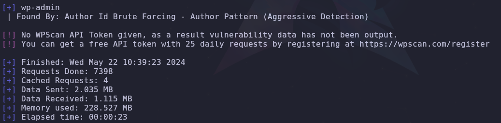
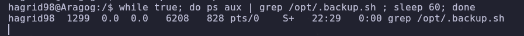

- Tags: #wordpress #PluguinWordPress #sql #linux 
____
cuando realizamos el escaneo de nmap nos aparece lo siguiente.
____

____
vemos que tenemos el puerto 22 y el 80 (SSH y HTTP) por lo revisaremos la pagina web y vemos que nos encontramos.
____

___
la pagina como tal es la siguiente, tenemos informacion adicional del wappalyzer en cuanto a las versiones y es que estamos antes un WordPress de version 5.0.12, y tambien se observa que existe una base de datos MySql, lo que haremos a continuación es aplicar fuzzing para enumerar directorios.
___

___
utilizando gobuster podremos enumerar directorios existentes,  en este caso tenemos a el directorio /blog/ el cual probaremos a continuación. 

una vez dentro del directorio nuevo debemos aplicar virtual hosting para cargar los recursos de la pagina, investigando la pagina llegamos a encontrar un panel del login de WordPress pero no es vulnerable a credenciales por defecto lo cual nos lleva al siguiente punto. 

debemos enumerar plugins del WordPress que tenemos presente, para esta tarea utilizaremos **wpscan** y vemos que nos enumera.
___

___
el error que vemos nos indica que debemos utilizar un **API token** y nos indica que nos registremos en la pagina, pero antes explicare a detalle el comando utilizado.
___
### Comando completo
```bash
wpscan --url http://192.168.0.108/blog/ --enumerate u,vp --plugins-detection aggressive --api-token=D0DP2Lp5fdG8AV7w77E0rFLE1RIntaM6CW9vLdZosko
```
### Parámetros y su descripción

1. **wpscan**:
   - Es el nombre del comando que llama a la herramienta WPScan.

2. **--url http://192.168.0.108/blog/**:
   - **--url**: Especifica la URL del sitio web de WordPress que se va a escanear.
   - **http://192.168.0.108/blog/**: La dirección URL del sitio web de WordPress objetivo.

3. **--enumerate u,vp**:
   - **--enumerate**: Permite enumerar diferentes tipos de elementos en el sitio web de WordPress.
     - **u**: Enumerar usuarios. WPScan intentará listar los nombres de usuario que existen en el sitio.
     - **vp**: Enumerar plugins vulnerables. WPScan intentará identificar plugins instalados que sean vulnerables.

4. **--plugins-detection aggressive**:
   - **--plugins-detection**: Define el método de detección de plugins. Puede tomar varios valores:
     - **passive**: Detección pasiva, sin realizar solicitudes adicionales que puedan ser detectadas por el servidor.
     - **mixed**: Combina métodos pasivos y activos para la detección.
     - **aggressive**: Detección agresiva, realiza más solicitudes y utiliza técnicas más invasivas para identificar plugins.

5. **--api-token=D0DP2Lp5fdG8AV7w77E0rFLE1RIntaM6CW9vLdZosko**:
   - **--api-token**: Proporciona el token de la API para acceder a la base de datos de WPScan. Este token es necesario para realizar ciertas consultas que requieren autenticación y acceso a información actualizada sobre vulnerabilidades.

una vez que utilizamos una API key, ya podemos ver como nos reporta los plugins y diferentes vulnerabilidades asociadas al mismo 
___

_____
de una vemos que un Plugin File Manager contiene vulnerabilidad por lo que buscando con searchsploit nos muestra lo siguiente.
___

___
tenemos un script de python el cual nos permite aprovecharnos de la vulnerabilidad.

El script permite cargar un archivo PHP malicioso en un sitio WordPress vulnerable y luego ejecutar comandos en el servidor comprometido, lo que puede llevar a la ejecución remota de código (RCE).
___

____
por lo que si ejecutamos el exploit y agregamos un comando el mismo nos sera devuelto de manera exitosa.

por lo que ahora nos queda entablar una reverse shell ganando así acceso al sistema de la maquina victima.

realizamos el tratamiento de la tty y empezamos a enumerar para así poder escalar privilegios.

aplicando:

**sudo -l **

**find \-perm -4000 2>/dev/null**

no obtuvimos resultado, pero recordando que antes visualizamos una base de datos MySql podremos averiguar donde se encuentra el archivo de configuración y así ver si cuenta con credenciales en texto claro.

buscando por la configuración del WordPress encontramos que se hacia una llamada a un archivo que estaba en una ruta distinta. y ese archivo contenía las credenciales en texto claro de la base de datos montada en el servidor, por lo que accedemos a la base de datos y vemos que podemos encontrar.
____

___
encontramos una tabla llamada wordpress la cual contenía lo siguiente.
___

____
un usuario con un hash que trataremos de descifrar con fuerza bruta. para eso nos ayudaremos de **john** y el diccionario de **rockyou.txt**.

con el siguiente comando de john lograremos descifrar la contraseña:

```shell
john -w:<diccionario> <hash encriptado>
```
____

___
y en efecto tenemos la contraseña. ahora podremos conectarnos por SSH.
___
aplicando el comando `find \-user hagrid89 2>/dev/null` obtenemos lo siguiente.
___

____
todo esos binarios, el que nos interesa esta marcado con rojo. con ls -la verificamos si el binario tiene permisos de lectura y escritura. en efecto tiene por lo que veremos que tiene dentro.
___

___
y vemos que esta realizando una copia recursiva de un directorio, nosotros le agregaremos el comando **chmod u+s /bin/bash** y se monitorear la ejecucion del programa cada minuto. utilizando el siguiente comando.
### . Monitorear los Procesos en Tiempo Real

Puedes utilizar `ps`, `top`, o `htop` para ver los procesos que se están ejecutando y buscar el binario en cuestión:

- **`ps`**: Ejecuta `ps` en intervalos regulares para ver si el binario aparece en la lista de procesos.
    
    `while true; do ps aux | grep [nombredelbinario] ; sleep 60; done`
    
    Este script verificará cada minuto si el binario está en ejecución.
    
- **`top` o `htop`**: Estas herramientas interactivas te permiten ver en tiempo real los procesos en ejecución. Simplemente busca el binario en la lista.
___

___
en efecto el programa se ejecuta cada minuto, ya después de haber pasado el minuto y que se haya ejecutado el script podremos aplicar el comando **bash -p** ganando el privilegio de root.


