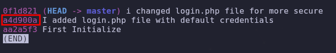

- Tags: #InformationLeakage #GithubProjectEnumeration #SLQI #linux 
_______
## Reconocimiento
_____
Se comienza el reconocimiento realizado un escaneo con nmap el cual nos permite saber que puertos estan abiertos.
___

_____
se observa que tenemos un repositorio activo y funcionando, por lo que si nos descargamos el repo con **wget** podríamos acceder al los commits del mismo y saber que cambios se implementaron.

## Explotación
___
con `git log` podremos ver los commits pero si utilizamos `git log --online` podremos ver un formato mas corto del mismo.
___

___
si utilizamos `git show` y le agregamos el id del commit, obtenemos los siguiente.
____

_____
podemos observar un correo y una contraseña la cual la probaremos en el apartado de inicio de sesion en la pagina web alojada en la maquina.
___

_____
una vez dentro probamos diferentes vectores de ataque como podría ser un [[LFI]] o una [[SQL Injection]], nos funciono la sql injection, siguiendo los pasos del articulo ya citado en este reporte.

conseguimos una tabla llamada SSH la cual contenía las credenciales para poder ingresar por ssh.

una vez dentro de la maquina investigando encontramos que hay un servicios corriendo por el puerto 9999 el cual no podemos ver desde nuestra maquina de atacante. 

utilizando el comando `netstat -tulpn | grep LISTEN` 
_____
### Uso de netstat
El comando `netstat -tulpn` se utiliza para mostrar una lista de conexiones de red activas, puertos en escucha y otras estadísticas de red en un sistema Unix/Linux. A continuación, se explican las opciones utilizadas:

- `-t`: Muestra las conexiones TCP.
- `-u`: Muestra las conexiones UDP.
- `-l`: Muestra solo las conexiones que están en modo de escucha (es decir, puertos en escucha).
- `-p`: Muestra el identificador del proceso (PID) y el nombre del programa asociado a cada conexión.
- `-n`: Muestra las direcciones IP y los números de puerto en formato numérico, en lugar de resolverlos a nombres de host y servicios.

El comando `grep LISTEN` filtra la salida del comando `netstat` para mostrar solo las líneas que contienen la palabra "LISTEN". Esto es útil para enfocarse únicamente en los puertos en escucha.
_______

____
tambien podemos ver el historial de la maquina en el archivo .bash_History el cual nos muestra que existe un usuario llamado losy.

si nos vamos a el directorio **/opt/web** podremos encontrar un archivo el cual se esta sirviendo en el servidor que ya se encuentra corriendo, y tiene la siguiente estructura.
____

___
este archivo llamado index.php si podemos acceder a el podremos ejecutar comando, pero ademas de eso podremos probar con curl para ver si funciona.
____

____
no tiene el formato correcto pero en teoría funciona, ahora lo que haremos es utilizar una herramienta que nos ayudara a realizar el **Port Forwarding** y convertir el puerto 9999 de la maquina victima en nuestro puerto para poder utilizar fichero php alojado.

utilizando una herramienta llamada chisel podremos hacerlo de la siguiente manera.
____

____
se configura tanto cliente como servidor, y asi cambiaríamos el puerto 9999 a nuestro localhost para poder acceder a el mismo.

ahora si accedemos a nuestro localhost desde el navegador podremos observar el contenido del index.php, y ahora si podremos ejecutar comandos y de esta forma entablar una reverse shell
____

___
entablando la reverse shell y en efecto, obtenemos conexion.
___

____
ahora buscamos los binarios con permisos SUID para ver si hay algo interesante. 

utilizando el comando `find \-perm -4000 2>/dev/null` buscaremos estos binarios.

encontramos el siguiente binario `./usr/bin/pkexec` , buscamos en google acerca de como explotarlo y encontramos un repositorio que nos ayuda con la tarea.

link: https://github.com/ly4k/PwnKit

una vez tengamos el archivo, montando un servidor en python y verificando tener wget en la maquina victima podremos cargar el archivo a la maquina victima y ejecutarlo.
___

___
De esa forma nos aprovechamos del binario para poder escalar privilegios.

