- Tags: #InformationLeakage #XML #sql 
____
para comenzar con la maquina lo primero que se hizo un escaneo con nmap el cual revelo 3 puerto abiertos, en los cuales destacan el puerto 80 y el 3306 de MySql.

empezamos viendo la web para ver que encontramos.
____

____
vemos un sitio web que es estatico el cual a simple vista no contempla alguna vulnerabilidad, pero investigaremos el codigo fuente en busca de pistas, se recalca que antes de entrar en la web se realizo fuzzing para descubrir directorios y demás, ademas con la herramienta whatweb se investigo sobre la web tratando de obtener alguna version de algun recurso, pero sin exitos.
____
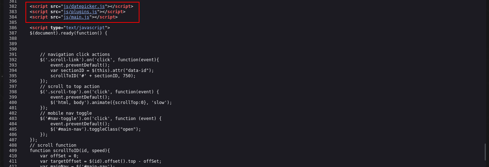
___
encontramos lo siguiente, esos tres recursos los cuales investigaremos y veremos a donde nos llevan.
___
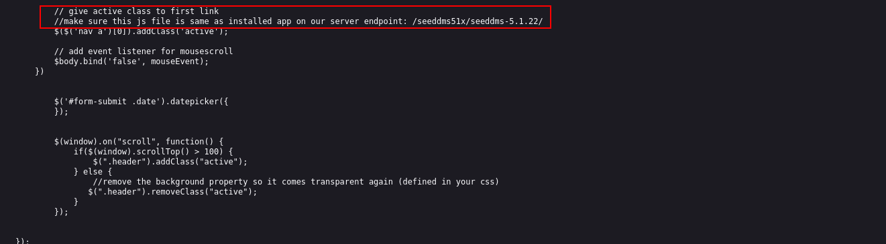
____
investigando el recurso main.js, nos encontramos con el siguiente comentario, el parecer nos da una URL o un endpoint, la cual probaremos. 
___
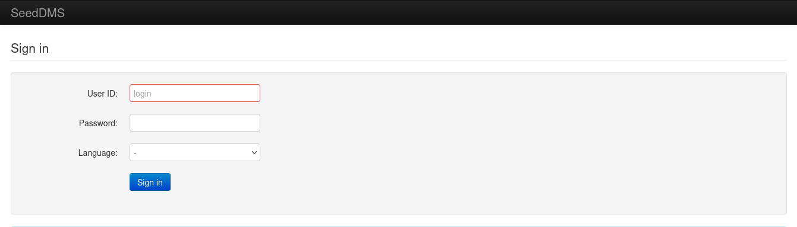
____
nos sale la siguiente login page, pero no contamos con credenciales. por lo que investigaremos que es SeedDMS y si tiene vulnerabilidades conocidas.

no se encontró ninguna vulnerabilidad conocida, pero puede que si haya una fuga de datos pues que investigando por encontramos algo de git hub que dice lo siguiente.
____
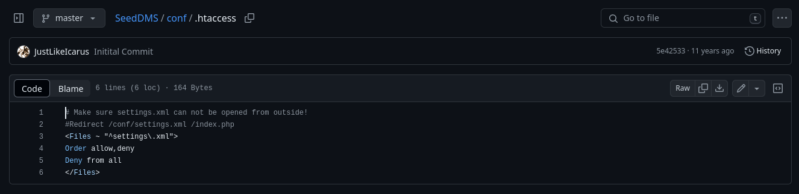
___
si accedemos a /conf/settings.xml podremos tal vez acontecer una fuga de informacion.
____
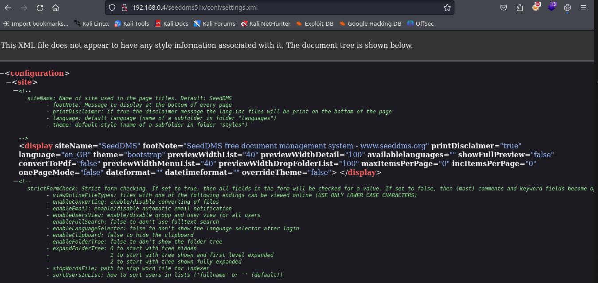
___
en efecto tenemos una fuga de información sensible por le exploraremos y vemos que encontramos.
___
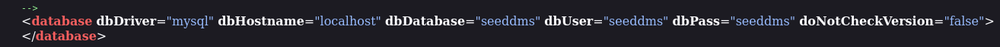
____
encontramos lo que parece ser unas credenciales de una base de datos, por lo que ya podremos acceder a la misma.
___
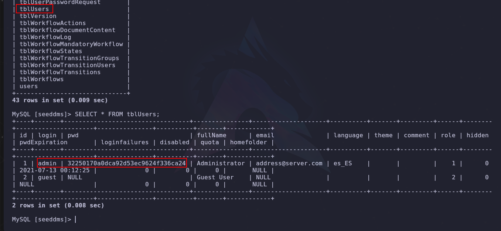
____
tenemos un hash MD5 el cual intentaremos cambiar para poder acceder a la pagina con el usuario admin pero con la clave que nosotros establezcamos. para cambiar la clave en la base de datos haremos lo siguiente:

- 1 - debemos codificar la contraseña que deseamos utilizar con MD5, eso lo podemos hacer desde consola con el siguiente comando: `echo -n <new_password> | md5sum` se aplica el    ` -n` para no aplicar salto de linea, por afectaría el hash.

- 2 - ahora debemos actualizar la base de datos con el comando:
	`UPDATE <TABLA_A_MODIFICAR> SET pwd= '<hash_MD5>' WHERE login= 'admin';`

- 3 - si todo sale bien los cambios deberían de ser aplicados correctamente, verificamos que todo se aplico correctamente e intentamos acceder a la pagina con el usuario y clave especificada.
_____
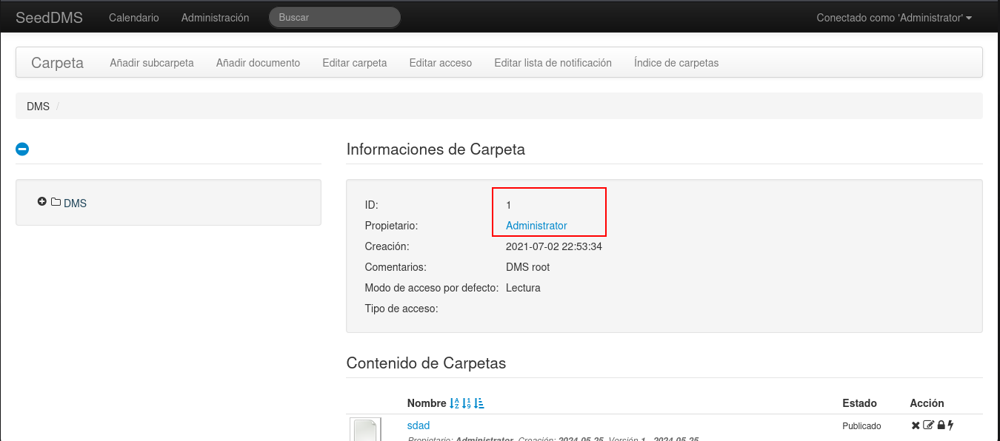
___
entramos como admin ahora tenemos que buscar un vector de ataque valido el cual contemple alguna vulnerabilidad y de allí aprovecharnos, busquemos en searchsploit el nombre de **SeedDMS** y veamos que se nos presenta.
___
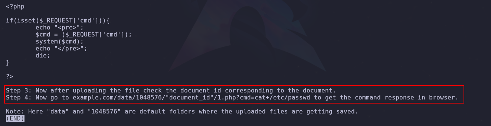
____
vemos que encontramos la instrucciones para acontecer un RCE (ejecucion remota de comando) por medio de un File Upload con extensión php, por lo que el documento nos indica que una vez se suba el archivo debemos buscar el archivo para conocer el id asignado al mismo.

el archivo va cargado con la siguiente estructura:

```php
<?php
 echo "<pre>" . shell_exec(&_GET['cmd']) . "</pre>";
?>
```

______
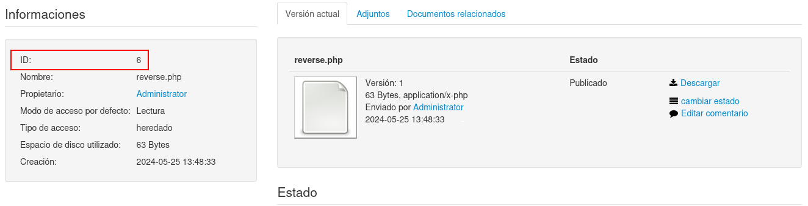
___
ahora que tenemos el id, debemos seguir la ruta que nos especifica las instrucciones y probar la ejecución remota de comando.
____
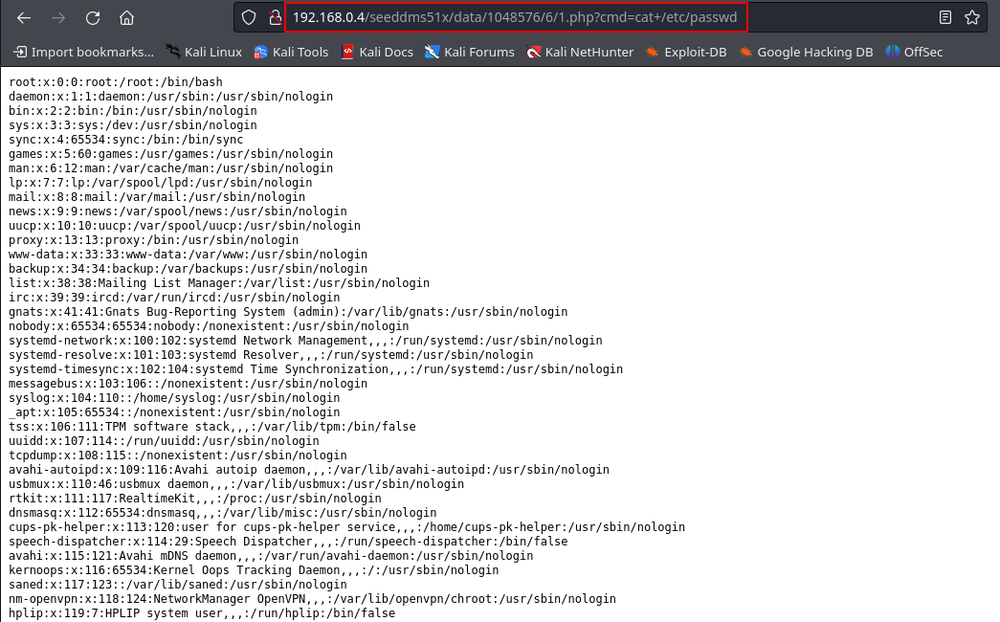
____
y tenemos ejecución remota de comandos, por lo que es hora de entablar una conexion con la maquina victima, para utilizaremos netcat.
____
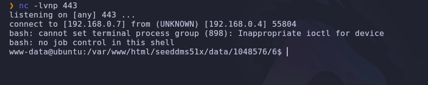
___
obtenemos acceso y ahora debemos estabilizar la tty para proceder a la escala de privilegios.

verificando los usuarios del sistema utilizando el siguiente comando.

```shell
cut -d: -f1 /etc/passwd
```

nos arroja el siguiente resultado.
____
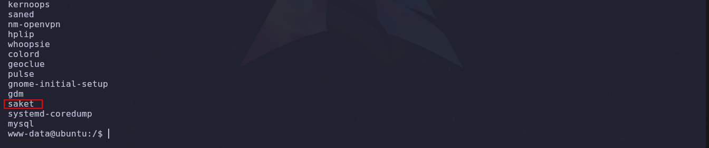
___
nos muestra todos los usuarios pero hay uno que destaca y es el usuario **saket** puesto vemos ese usuario en la base de datos antes expuesta.
____
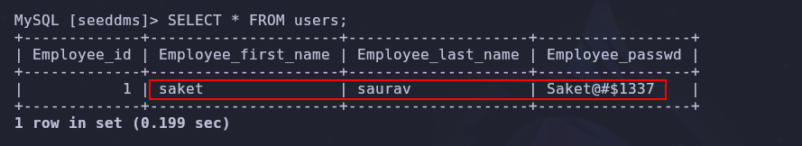
____
por lo que si migramos a ese usuario, y vemos que permisos tenemos nos daremos cuenta que tendremos permisos absolutos, por lo que podremos migrar a root aplicando un simple sudo su.
____
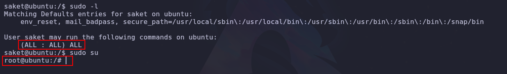
___
y es así que terminamos la maquina.