____
se comienza como siempre, realizando escaneo de puertos con nmap.

se nos presentan 3 puerto abiertos los cuales son los siguiente:
____
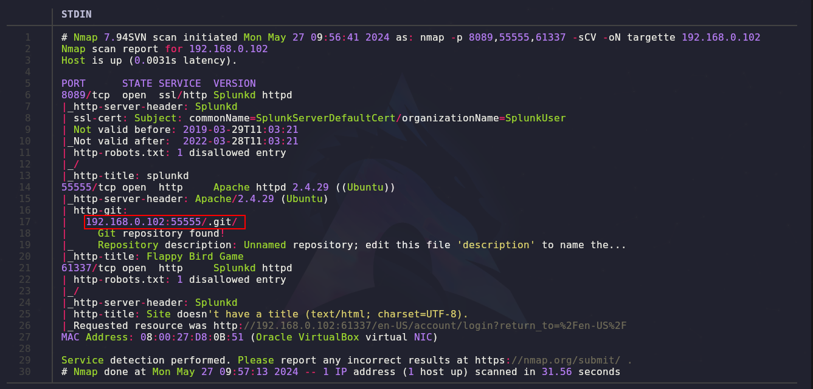
____
vemos que ya de primera se nos reporta que hay un repositorio activo en la ruta indicada, por lo que exploramos y con el comando `wget -r <url>` descargamos todo el contenido y usando `git log --oneline` podemos ver todo el historial de commits, y se nos presentan los siguientes commits:
___
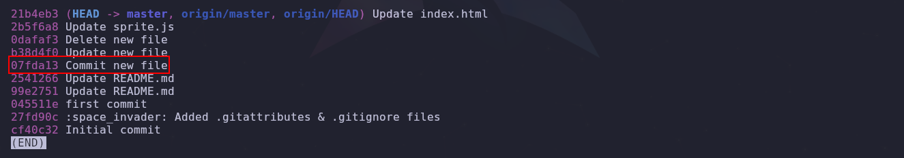
___
exploramos todos, pero el marcado tiene algo interesante y es que si aplicamos el siguiente comando `git ls-tree <id_del_commit>` podremos ver un secret.
____
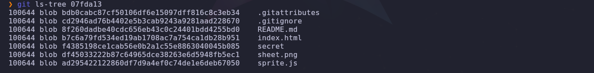
___
pero si queremos acceder al mismo nos dará un error.
_____
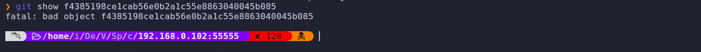
___
por lo que debemos explorar diferentes opciones, si nos vamos a la ruta donde se encuentra el .git, veremos que podemos navegar por directorios.
___
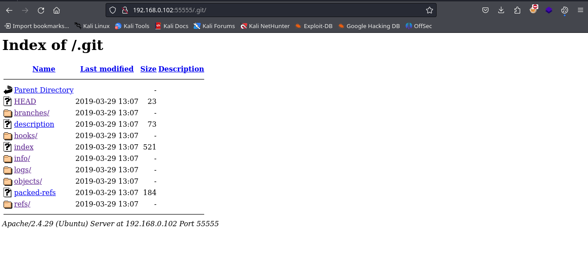
____
si entramos al directorio logs, podemos encontrar lo siguiente.
___
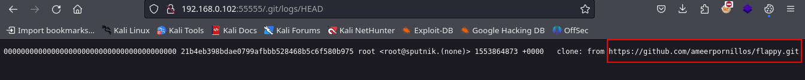
____
lo que nos indica que el proyecto real es el que se encuentra en ese repositorio por que empleando git clone, podremos traerlo a nuestra area de trabajo e investigar los logs para poder comparar y ver si son los mismos.
____
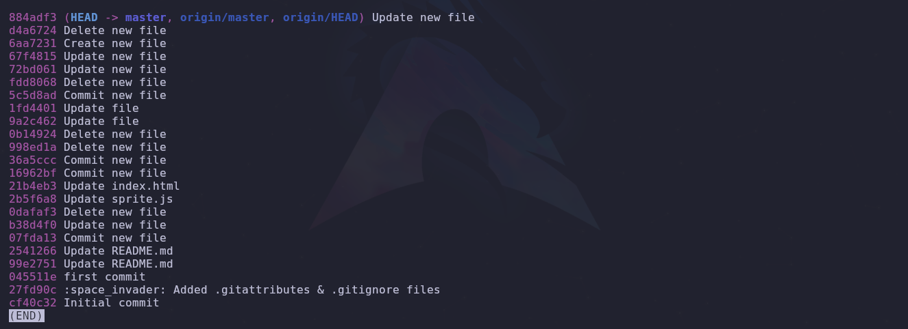
____
los commits del proyecto son lo siguientes por lo que veremos el primer commit que nos indica que se creo un nuevo archivo, no son el mismo commit pero veamos la estructura del mismo.
___
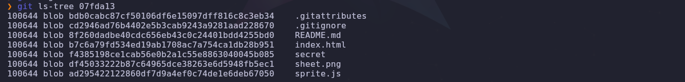
___
el identificador del secret si que es el mismo que el anterior por lo que si lo abrimos nos aparece lo siguiente:

**sputnik:ameer_says_thank_you_and_good_job**

son credenciales al parecer, si nos dirigimos al puerto 61337 veremos que tenemos un panel de login y si ingresamos las credenciales veremos que sucede.
____
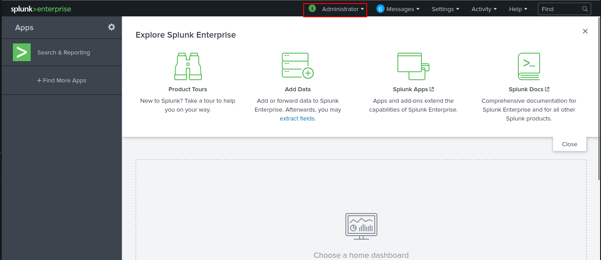
____
nos logueamos como administrador, por lo que ahora tenemos que buscar la forma de ganar acceso a la maquina, por medio de esta web.

si buscamos el nombre de la web y le colocamos exploit nos aparecerán paginas de github explicando la vulnerabilidad que esta pagina presenta.

se nos dice que debemos cargar un archivo que contiene una carga util ya diseñada, y que el archivo debe de tener la extensión **.spl** también nos indica que al momento de cargar el archivo ya debemos estar a la escucha por medio de netcat.

ya después que se carga el archivo este se ejecuta automáticamente, dándonos acceso a la maquina victima.
____
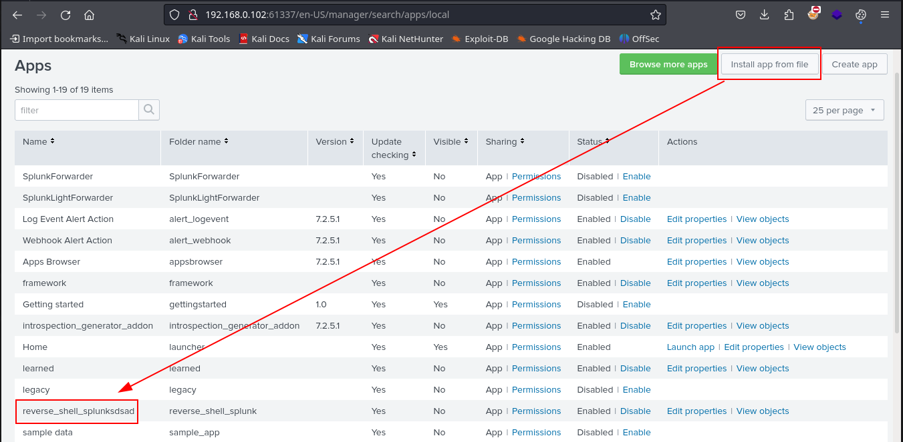
____
una vez dentro de la maquina victima, buscaremos el medio para escalar privilegios. si aplicamos sudo -l veremos que nos solicita contraseña por que probaremos con contraseña antes encontrada. 
____
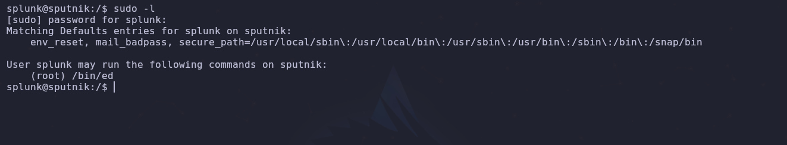
___
funciona, y nos dice que podemos ejecutar el **ed** para ver como podemos llegar a escalar privilegios por medio del mismo buscaremos en la pagina https://gtfobins.github.io/ y vemos que nos dice.
____
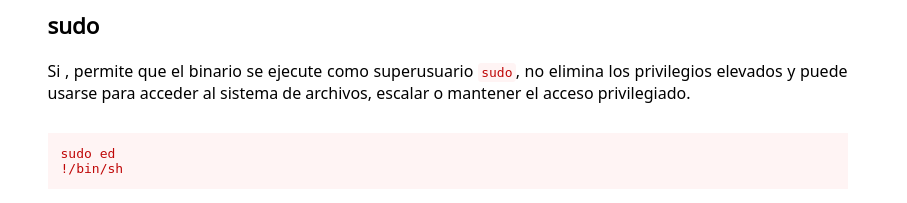
____
ejecutando ese simple comando podemos llegar a ser root, así que lo intentaremos.
___
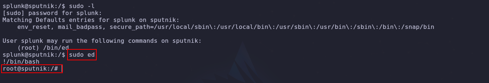
____
tenemos root, damos por concluida la maquina.
____
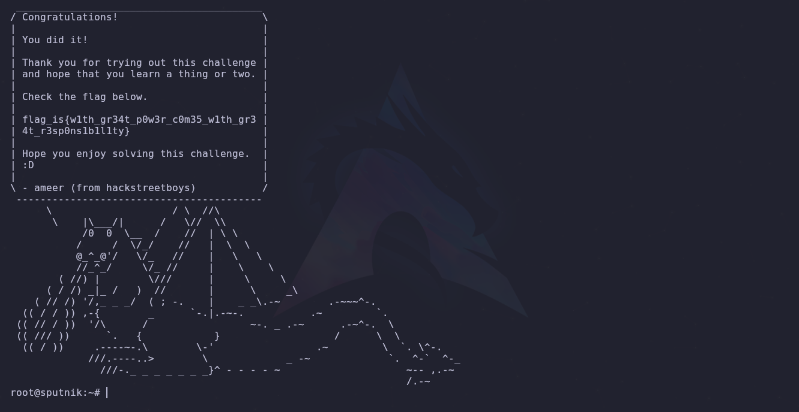

