- Tags: #pivoting 
_____
seguimos con la maquina analizando el reporte de nmap para ver que podemos explotar.
___

_____
vemos que tenemos 5 puertos abiertos, al igual que vemos versiones, también tenemos un servicio de samba activo. 

empezaremos empleando smbmap para escanear el servicio de samba para ver si hay recursos en los que tengamos permiso de lectura.
____
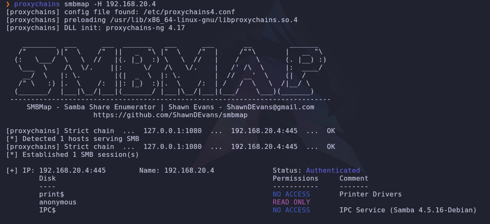
____
vemos que tenemos un directorio **anonymous** el cual tenemos permisos de lectura, veremos que tiene dentro utilizando el comando `proxychains smbmap -H <direccion_ip> -r <direcctorio>`  
___
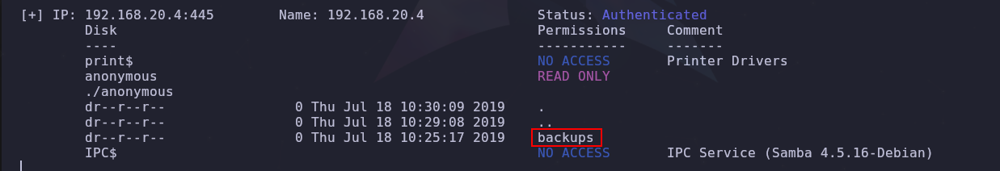
___
vemos que tenemos otro directorio llamado **backups** el cual examinaremos.
___
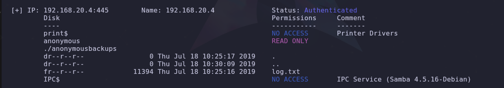
_____
ahora tenemos un archivo de texto el cual descargaremos y veremos su contenido.
___
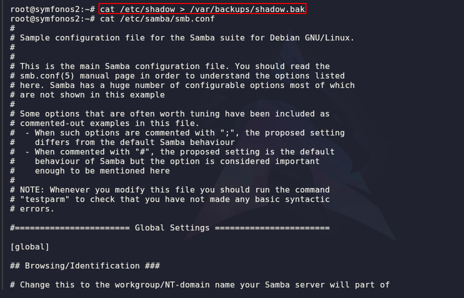
___
vemos que la ruta donde se encuentra el archivo **shadow.bak**.

contexto de shadow.bak:

El archivo `shadow.bak` es una copia de seguridad del archivo `/etc/shadow`, que es fundamental para la seguridad de un sistema Unix o Linux. Este archivo contiene la información de las contraseñas de los usuarios del sistema, en un formato cifrado.

es por ello que conocer su ruta podría suponer una vulnerabilidad puesto que si encontramos la forma de llegar al mismo podríamos tratar de descifrar su contenido.

si vemos nuevamente el contenido del reporte de nmap veremos que tenemos el puerto 21 (FTP) con una versión algo vieja, en concreto es la versión **proFTP 1.3.5** la cual al buscarla con searchsploit nos muestra lo siguiente.
____
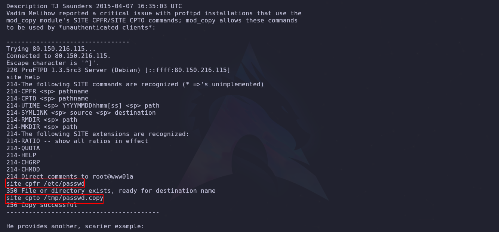
___
al parecer tiene una vulnerabilidad que nos permite copiar archivos desde una ruta conocida, hasta otra ruta del sistema. 

por lo que anteriormente la ruta que vimos del archivo shadow.bak, trataremos de copiar el archivo a la carpeta o ruta que nos comparte el servicio de ftp, pero para eso necesitamos su ruta.
____
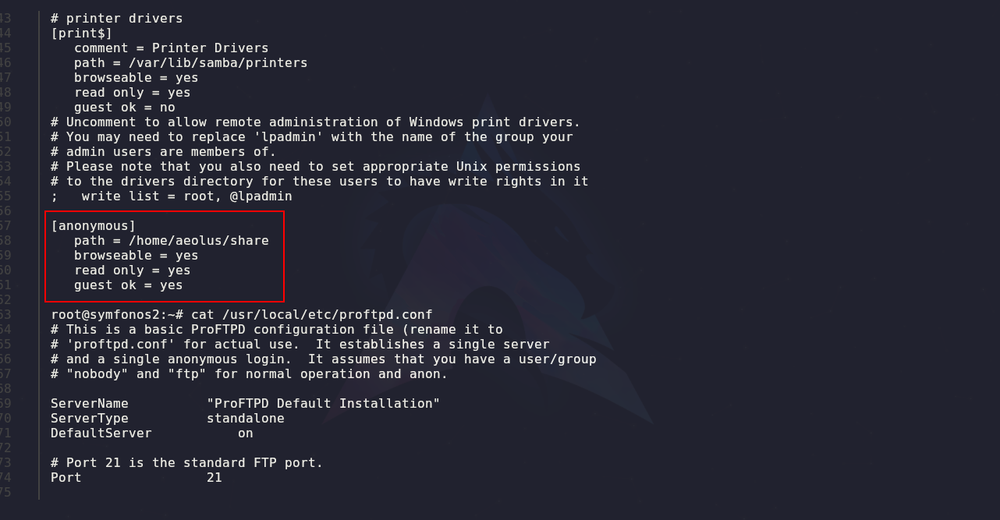
____
se observa la ruta de la carpeta anonymous, ya teniendo esto podemos proceder y ver si funciona.
___
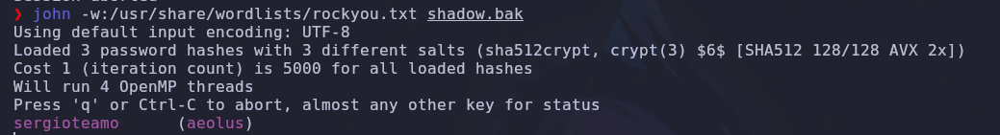
usando john y un diccionario para descifrar la contraseña obtenemos lo siguiente.

son credenciales que usaremos para acceder por ssh.

una vez accedemos por ssh debemos buscar formas para escalar privilegios.

aplicando comando como `find \-perm -4000 2>/dev/null` para listar binarios y `cut -d: -f1 /etc/passwd` para listar los usuarios del sistema. 

en este caso en particular veremos que puertos se encuentran abiertos puesto que puede que hayan puerto que no podamos ver a través de nuestro tunel con proxychains, por lo que aplicamos el comando `ss -nltp`.
____
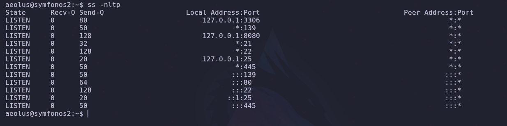
____
vemos que tenemos un puerto **8080** abierto pero desde nuestra maquina atacante no es accesible por lo que utilizaremos **SSH** para aplicar un **Local Port Forwarding** y el puerto 8080 de la maquina victima traerlo a nuestra maquina y así poder ver su contenido.

por lo aplicamos el siguiente comando con ssh:

```shell
proxychains ssh aeolus@192.168.20.4 -L 8080:127.0.0.1:8080
```

una vez aplicado el comando ya podremos acceder al puerto 8080 por medio de nuestro local host.
____
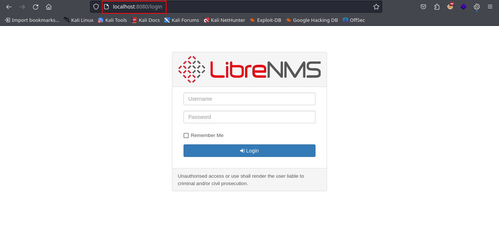
____
vemos que tenemos accesibilidad al puerto, recordemos que tenemos credenciales por lo que probaremos a ver si nos autentica.
____
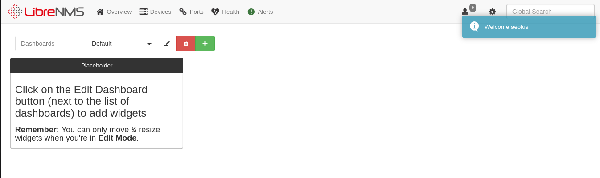
____
estamos dentro, por lo que ahora debemos buscar vulnerabilidades asociadas a **libreNMS** utilizando searchsploit.
____
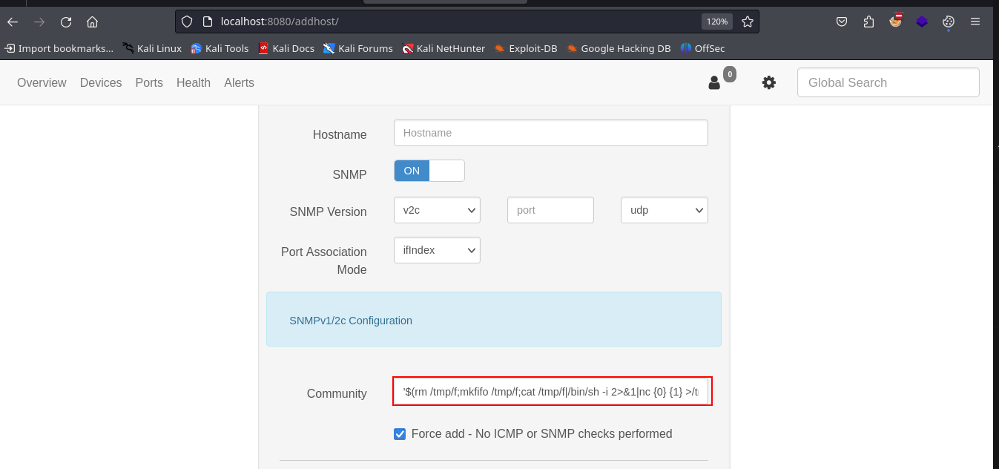
____
### Forma local
nos encontramos con una vulnerabilidad que nos permite ejecutar codigo, y nos da instrucciones ademas del payload a utilizar, lo pegamos y establecemos nuestra ip y puerto.

esta es una forma de cambiar de usuario a uno con mas privilegios. y es la forma local por asi decirlo de hacerlo.

hacemos referencia a local porque la reverse shell es enviada a la misma maquina symfonos 2 y no a nuestra maquina de atacante.
_____
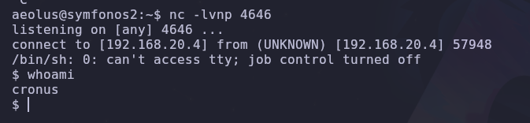
_____
antes eramos el usuario aeolus y ahora somos el usuario cronus. 

### forma con socat
_____
con esta forma redirigiremos el flujo nos mande la maquina symfonos 2 a la symfonos 1, pensemos que la maquina symfonos 1 nos hará de puente nuevamente para que ese trafico llegue a nuestra maquina de atacante, a continuación un diagrama que lo explica.
_____
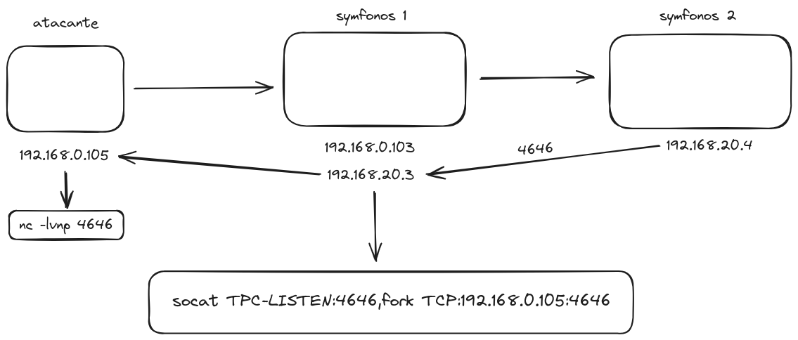
_____
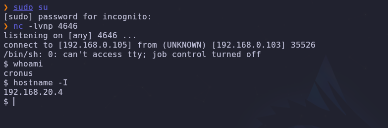
_____
y es así como manejamos los paylodad si lo queremos enviar desde una 3era maquina a nuestra maquina atacante.

ahora a elevar privilegios, si aplicamos un `sudo -l` vemos que podemos ejecutar mysql como root.
____
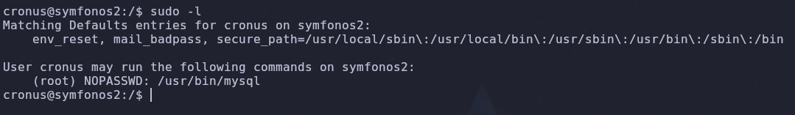
____
por lo que buscamos como elevar privilegios y nos aparece el siguiente comando.

```shell
sudo mysql -e '\! /bin/sh'
```

de esa forma ganaremos root en la maquina synfonos 2.
____
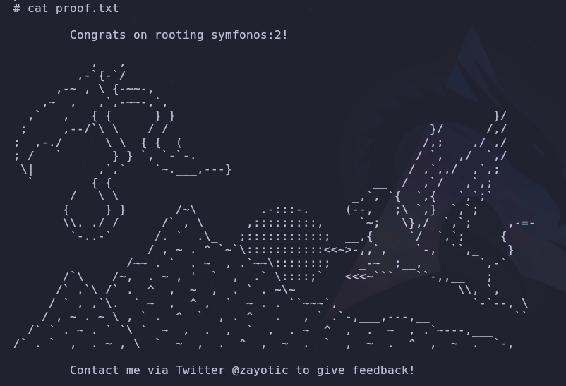
