- Tags: #wrappers #LFI #sshInject 
____
se comenzo la maquina con un escaneo de nmap en el cual se puede apreciar que hay dos puertos abiertos los cuales son el 22 - 80 (SSH - HTTP) se le aplico los script basicos de reconocimiento de namp.

accedemos a la pagina web para investigar pero nada interesante, por lo que aplicamos fuzzing con gobuster el cual nos revela un directorio llamado **/console/** en el cual se encuentra un archivo file.php el cual no podemos ver el contenido por lo que usaremos wrappers para permitir que nos muestre el contenido pero el base64 y posteriormente lo decodificaremos.
____
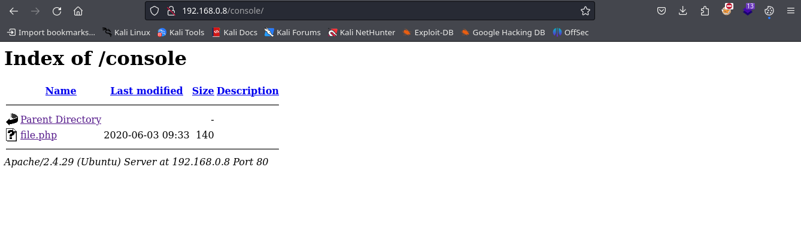
___
una vez utilizamos el wrapper nos aparece lo siguiente
___
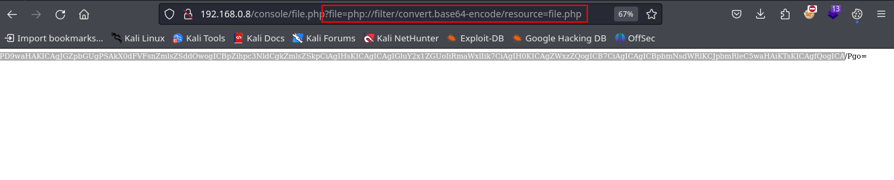
___
se puede observar ahí una cadena en base64 generada por el wrapper, una vez decodificada nos aparece lo siguiente.
___
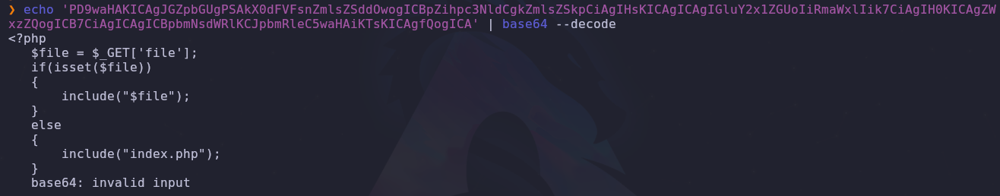
_____
ese es el contenido del archivo, por lo que con este fichero podemos ejecutar comando pero aun lo tenemos que escalar a un RCE. por lo que exploraremos los logs para ver cuales son accesibles.

el log accesible es el de SSH en la siguiente ruta **/var/log/auth.log**
___
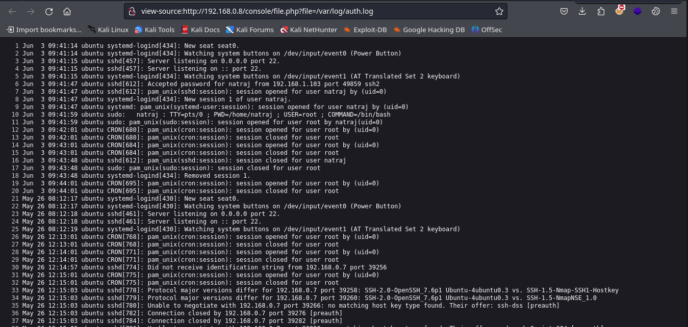
____
por lo que precederemos a usar SSH para envenenar el log, ahora encontraremos un error de ssh puesto que la vulnerabilidad de inyectar comandos por medio del mismo fue parcheada por lo que nos presentara el siguiente error.
____
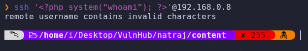
____
utilizaremos otra vía para llegar a inyectar el comando, utilizando **msfconsole** podremos llevar acabo la tarea.

utilizando el siguiente comando: `use auxiliary/scanner/ssh/ssh_login` tendremos variedad de opciones, pero solo configuraremos el nombre, contraseña y claro direccion ip de la victima. todo esto no permitirá inyectar el comando y que así podamos ejecutar comandos remotos.
___
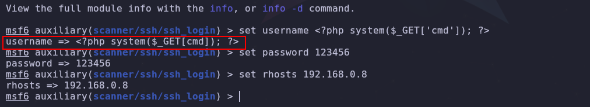
____
ahí tenemos todo configurado, en el apartado de usuario es donde colocaremos nuestra carga util.

una vez configurado todo debemos correrlo con el comando **run**. 

si actualizamos la ruta del log y aplicamos un comando vemos si funciona.
____
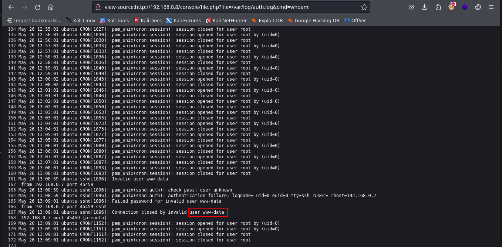
___
aplicamos el comando whaomi y tenemos respuesta, por lo que ahora debemos entablar una reverse shell y asi obtener acceso a la maquina.

buscamos formas de escalar privilegios, con el comando find \-perm -4000 2>/dev/null no obtenemos resultados, por lo que buscamos que archivos tienen permisos de escritura en el usuario www-data.

para eso usamos el siguiente comando `find / -writable 2>/dev/null` pero debemos filtrar para ver los resultados que queremos, usando **grep -vE** indicamos que no queremos ver lo que le pasemos como argumento, ademas de permitirnos colocar mas de un argumento.
___
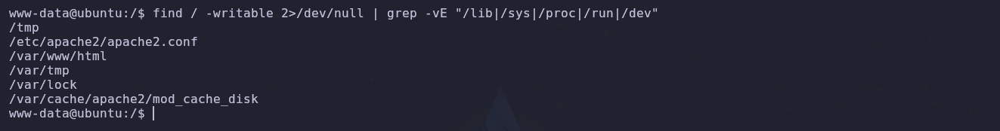
___
nos indica que tenemos permisos de escrituras sobre el archivo **apache2.conf** y si vemos quien esta ejecutando el fichero podemos ver que el usuario root.

de esto nos podemos aprovechar al cambiar el usuario que esta levantando el servicio de apache y si recordamos como accedimos dependiendo de que usuario levante el servicio de apache una vez contaminemos el log y accedamos nuevamente accederemos como el usuario que ha levantado el servicio nuevamente con una excepción de que no nos permite colocar root y ademas tendremos que reiniciar la maquina puesto que no hay un tarea cron que reinicie el servicio automáticamente. 
____
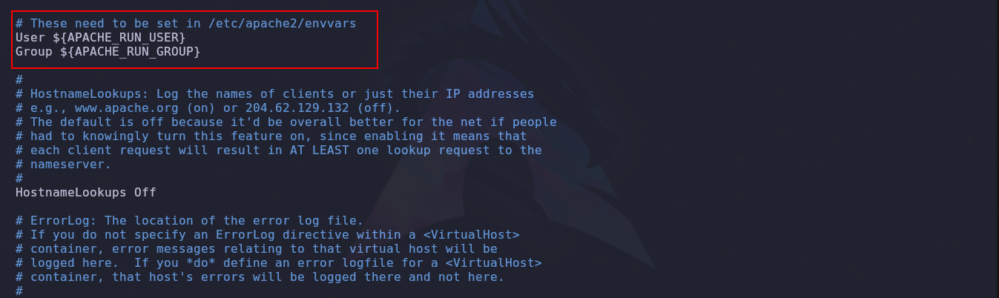
___
en este apartado con variables de entorno cambiaremos el usuario, el cual debemos conocer con anticipación.
____
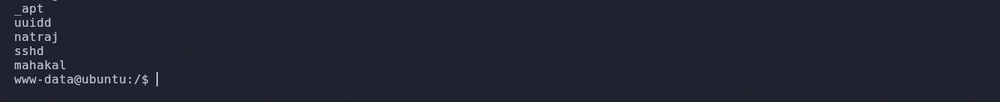
____
usaremos el usuario **mahakal**.
___
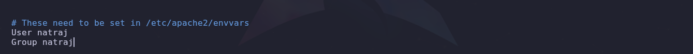
___
guardamos y reiniciamos y vemos que pasara.
____
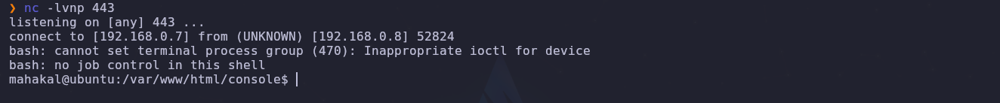
____
y en efecto iniciamos como el usuario mahakal, ahora vemos nuevas forma de escalar privilegios.
___
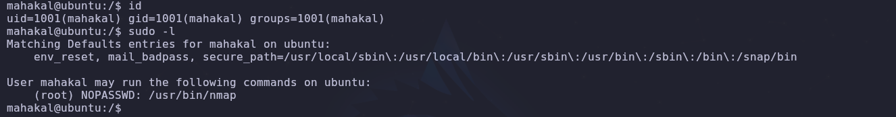
____
vemos que podemos ejecutar nmap y ejecutando los siguientes comando obtendremos root.
____
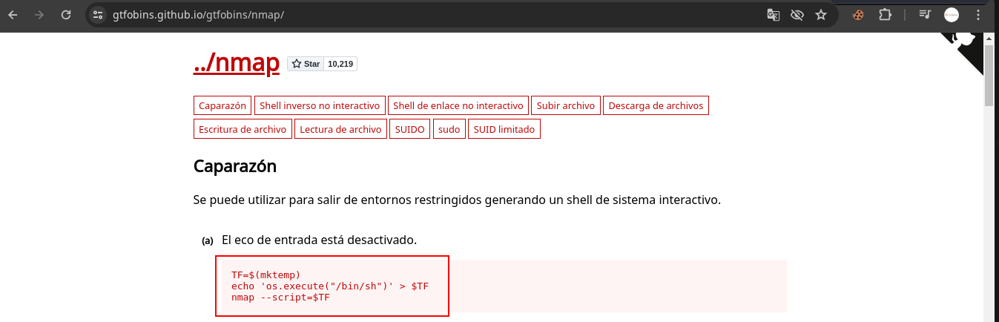
____
fin...
